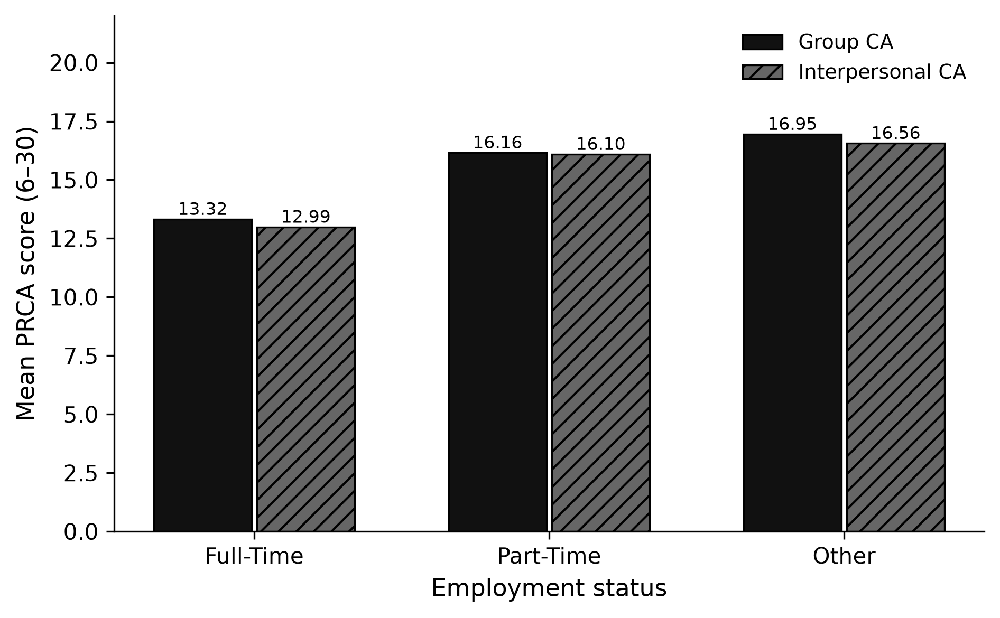

**Notebook:** [`notebooks/cleaning_eda_full_cohort.ipynb`](../notebooks/cleaning_eda_full_cohort.ipynb)  
**Code:** [`src/ca_personas/load.py`](../src/ca_personas/load.py) · [`eda.py`](../src/ca_personas/eda.py)  
**CLI:** `ca-personas prepare --join inner`  
**Artifacts:** `outputs/eda/`  
**Merge sanity check:** [`merge_coverage_sanity.md`](merge_coverage_sanity.md)

---

## Why this page exists

Every persona tier, ML baseline, and secondary RQ rests on the same cleaned analytic sample. This page records how that sample is built and what the empirical CA patterns look like by employment, transit, sex, student status, and country — the slices used later when interpreting LLM stereotyping error. The `demos` persona tier’s base demographics layer is Age, Sex, Country of residence, and Student status.

## Sample construction

| Step | N |
|---|---:|
| Prolific File A + File B (unique IDs) | 262 |
| Qualtrics File C rows | 273 |
| Matched Prolific ∩ Qualtrics | **252** |
| Qualtrics-only (disregard) | 21 |
| Prolific-only (disregard) | 10 |
| Dropped incomplete PRCA items | 11 |
| **Analytic sample (complete group + interpersonal GT)** | **241** |

Waves (matched respondents): File A = 99, File B = 153 of the 252 Prolific∩Qualtrics matches. Full Prolific waves omit Ethnicity / Nationality / Language; the `demos` tier therefore uses Age, Sex, Country of residence, and Student status.

**Covariate coverage in the analytic sample:** employment 100%, transit (`Q26–Q29`) 100%, Student status 93.0% non-missing (17/241 `DATA_EXPIRED` → missing).

## Ground-truth CA

| Subscale | n | Mean | SD | Median | Range |
|---|---:|---:|---:|---:|---|
| Group CA | 241 | 14.62 | 6.03 | 13 | 6–30 |
| Interpersonal CA | 241 | 14.31 | 5.82 | 13 | 6–30 |

Band prevalence (low ≤13 / moderate 14–19 / high ≥20): group **53.9% / 25.3% / 20.7%**; interpersonal **53.1% / 28.6% / 18.3%**.

## RQ1 lens — employment



| Employment | n | Mean group CA | Mean interpersonal CA | % high group |
|---|---:|---:|---:|---:|
| Full-Time | 148 | 13.32 | 12.99 | 12.8% |
| Part-Time | 31 | 16.16 | 16.10 | 25.8% |
| Other | 62 | 16.95 | 16.56 | 37.1% |

Full-time respondents report lower CA. If an LLM stereotypes “unemployed / other → higher anxiety,” that pattern has some empirical footing in this sample — residual error analyses should still check whether the model *over*-applies it.

## RQ2 lens — public transit (`Q26`)

| Q26 | n | Mean group CA | Mean interpersonal CA |
|---|---:|---:|---:|
| Never | 50 | 17.38 | 16.34 |
| 0–1 days/month | 37 | 15.38 | 15.16 |
| 2–4 days/month | 53 | 14.51 | 13.72 |
| 4–8 days/month | 46 | 13.28 | 13.48 |
| 8+ days/month | 55 | 12.84 | 13.16 |

Higher ridership ↔ lower mean CA (Never group M = 17.38 → 8+ days M = 12.84). This is the descriptive foundation for [Transit → CA](secondary_rq_transit_ca.md) ([memo](../memos/transit_riders_ca.qmd)) and [CA → Transit](secondary_rq_ca_predicts_transit.md) ([memo](../memos/ca_scores_predict_transit.qmd)).

## Stereotyping lens — sex, student status & country

| Slice | n | Mean group CA | Mean interpersonal CA |
|---|---:|---:|---:|
| Female | 120 | 14.88 | 14.75 |
| Male | 121 | 14.37 | 13.88 |
| United States | 158 | 14.04 | 13.90 |
| United Kingdom | 56 | 16.34 | 15.54 |
| Canada | 20 | 14.65 | 15.15 |
| Student = Yes | 34 | 16.35 | 17.03 |
| Student = No | 190 | 14.26 | 13.77 |

Sex differences are small. UK means sit higher than US in this sample; students show elevated interpersonal CA. Sparse countries (n = 1–2) are not interpretable alone.

## Implication for the manuscript

- Persona tiers that add **employment** or **transit** are adding covariates that track true CA in the cohort.
- Bias analyses should compare LLM absolute error against these empirical group means — not against a flat “everyone is average” null.
- Secondary RQs convert the transit gradient into formal tests and predictive metrics.

## Reproducibility

```bash
ca-personas prepare --join inner
jupyter nbconvert --to notebook --execute notebooks/cleaning_eda_full_cohort.ipynb
```
