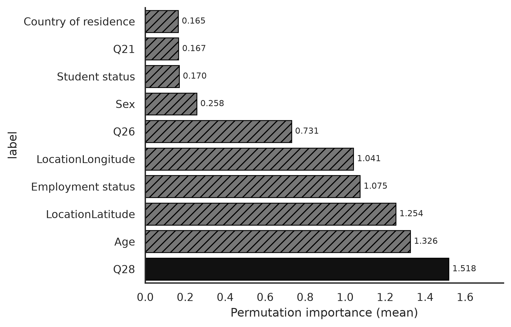

**Notebook:** [`notebooks/factor_feature_importance.ipynb`](../notebooks/factor_feature_importance.ipynb)  
**Code:** [`src/ca_personas/feature_importance.py`](../src/ca_personas/feature_importance.py)  
**Artifacts:** `outputs/feature_importance/`

---

## Why these diagnostics matter

Two measurement questions sit under the LLM persona work:

1. Are the **group** and **interpersonal** PRCA item sets behaving like distinct (or at least coherent) subscales in this cohort?
2. Which **persona covariates** actually predict ground-truth CA in a tabular learner — i.e., which cues *should* matter if an LLM is using information “sensibly”?

## Item factor structure (PRCA items)

Exploratory factor analysis / PCA on the scored group (`Q1–Q6`) and interpersonal (`Q13–Q18`) items (after reverse-coding comfort items) supports treating the two subscales as related but separable evaluation targets. Loadings concentrate on the intended item blocks; reverse-coded calm/comfort items load strongly on the dominant apprehension factor.

Practical takeaway for the manuscript: reporting **separate** MAE for group vs interpersonal CA is justified; collapsing to a single “CA” score would hide subscale-specific error.

## Covariate permutation importance

A Random Forest predicting CA from persona-style covariates on the **full matched analytic cohort (N = 241)**, with permutation importance on held-out folds, ranks features as follows (mean importance across group + interpersonal targets).

**Reconciliation note.** This table (permutation importance on held-out folds) and the TreeSHAP ranking in [`memos/feature_predictive_power_ml_llm.md`](../memos/feature_predictive_power_ml_llm.md) (mean \|SHAP\| at the `transit` tier, real vLLM-backed outputs in `outputs/shap_eval/`) both rank covariates for predicting **CA**, but with different explainers: permutation puts Age 2nd, while TreeSHAP puts Employment 2nd and Age 6th. Q28 (ride-share days) leads under both. A third ranking — the surrogate SHAP of the live DeepSeek v2 persona agent — shows the LLM over-weights geolocation and Age relative to the Q28/employment mix that predicts true CA (see the memo). Neither the permutation nor the TreeSHAP ranking is a “global” importance order for predicting **regular transit** (see secondary RQ memos), where Q28 (AUC 0.762) still leads but Age and longitude also carry weight.



| Rank | Feature | Permutation importance |
|---:|---|---:|
| 1 | Q28 (ride-share days) | 1.518 |
| 2 | Age | 1.326 |
| 3 | LocationLatitude | 1.254 |
| 4 | Employment status | 1.075 |
| 5 | LocationLongitude | 1.041 |
| 6 | Q26 (public-transit days) | 0.731 |
| 7 | Sex | 0.258 |
| 8 | Student status | 0.170 |
| 9 | Q21 (car access) | 0.167 |
| 10 | Country of residence | 0.165 |

Full File A/B waves omit ethnicity / nationality / language, so those fields are not in this ranking. `Q27`/`Q29` and license (`Q20`) remain low relative to Q28, age, geo, and employment.

## Interpretation against LLM tiers

| Finding | Implication for persona prompts |
|---|---|
| Q28 (1.518), Age (1.326), lat/long, and employment dominate tabular importance | `transit` and `geo` tiers are the most justified contextual additions |
| Employment ranks 4th (1.075) | RQ1 (employment lift) should show incremental, not dramatic, gains — matching RF MAE 5.72→5.59 ([`ml_baselines.md`](ml_baselines.md)) |
| Sex importance = 0.258 (rank 7) | Large LLM error gaps by sex would look more like stereotyping than “using the sample’s real signal” |
| Ride-share Q28 (1.518) > public transit Q26 (0.731) for predicting CA | Models (and prompts) that only mention bus/train may miss the higher-ranked mobility cue; reverse-prediction also favors Q28 (AUC = 0.762; [memo](../memos/q27_q28_predict_transit.md)) |

## Reproducibility

```bash
# Requires staged File A/B/C (never excerpts for reported tables)
jupyter nbconvert --to notebook --execute notebooks/factor_feature_importance.ipynb
```

Key outputs: `outputs/feature_importance/top_predictive_features.csv`, `ca_item_fa_loadings.csv`, importance CSVs per target. Re-run verified on full cohort N = 241 (`seed`/defaults as in `feature_importance.py`).
