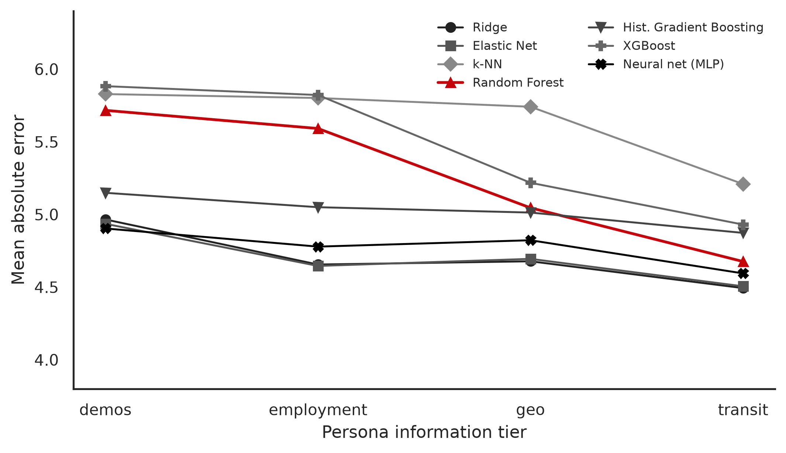
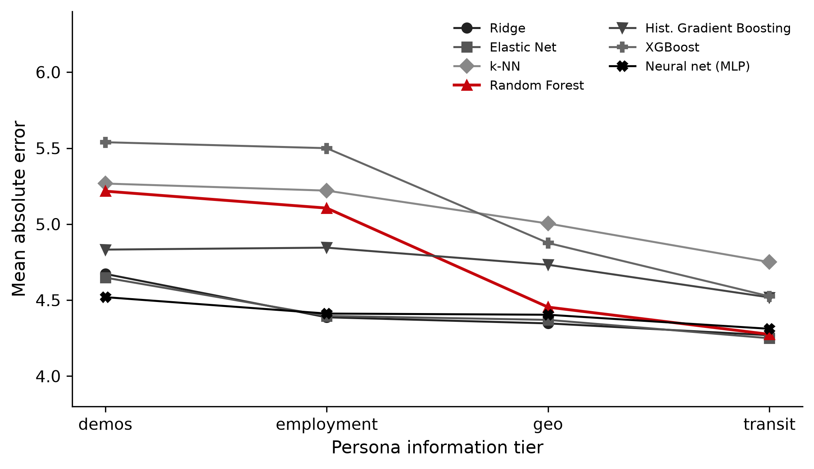
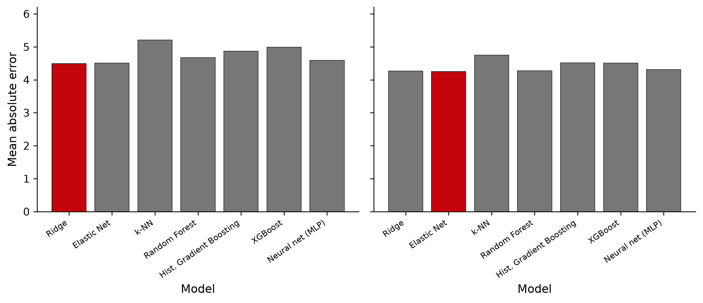

**Notebook:** [`notebooks/stage_one_ml_baseline.ipynb`](../notebooks/stage_one_ml_baseline.ipynb)  
**Code:** [`src/ca_personas/ml_baseline.py`](../src/ca_personas/ml_baseline.py)  
**CLI:** `ca-personas ml-baseline`  
**Artifacts:** `outputs/ml_baseline/`  
**Companion comparison:** [`ml_vs_llm.md`](ml_vs_llm.md)

---

## Research role

Before asking whether an LLM stereotypes CA from persona prompts, we need a **tabular ceiling / floor**: how well do standard and modern regressors recover the same PRCA targets from the same cumulative feature sets?

| Tier | Features (available in full File A/B/C) |
|---|---|
| `demos` | Age, Sex, Country of residence, **Student status** (base demographics layer; optional ethnicity/nationality/language when present) |
| `employment` | + Employment status |
| `geo` | + survey lat/long |
| `transit` | + Q26–Q29, Q20, Q21 |

**Targets.** `gt_group_ca`, `gt_interpersonal_ca` (PRCA subscales, 6–30).

**Model suite (7 learners).** The stage-one baseline is no longer RF + k-NN alone. We evaluate a deliberately mixed suite so the LLM comparison is not tied to one inductive bias:

| Family | Model | Role |
|---|---|---|
| Linear | **Ridge**, **Elastic Net** | Strong regularized linear baselines after one-hot + scaling |
| Instance | **k-NN** (*k* = 3, distance-weighted) | Local nonparametric reference |
| Tree ensemble | **Random Forest** (200 trees) | Classic nonlinear tabular baseline from earlier memos |
| Boosting | **Hist. Gradient Boosting**, **XGBoost** | Modern tree boosters |
| Neural | **MLP** (1×32 hidden, Adam) | Small feed-forward neural net on the same features |

**Evaluation.** Shuffled 5-fold CV (`random_state=42`) on the full analytic cohort (**N = 241**); predictions clipped to [6, 30]; primary metric = MAE (aligned with LLM absolute error), plus RMSE, R², and qualitative band accuracy.

---

## Full-cohort results (N = 241)



*Figure. Group-CA mean absolute error by persona tier for all seven models (seed = 42).*



*Figure. Interpersonal-CA MAE by persona tier for the same suite.*



*Figure. Transit-tier MAE by model (best model highlighted).*

### Group CA — MAE by model × tier (↓ better)

| Model | demos | employment | geo | transit |
|---|---:|---:|---:|---:|
| Ridge | 4.97 | 4.66 | 4.68 | **4.49** |
| Elastic Net | 4.94 | **4.65** | 4.69 | 4.51 |
| k-NN | 5.83 | 5.84 | 5.74 | 5.21 |
| Random Forest | 5.72 | 5.59 | 5.05 | 4.68 |
| Hist. Gradient Boosting | 5.15 | 5.05 | 5.01 | 4.87 |
| XGBoost | 5.81 | 5.90 | 5.26 | 4.99 |
| Neural net (MLP) | **4.90** | 4.78 | 4.82 | 4.59 |

### Interpersonal CA — MAE by model × tier

| Model | demos | employment | geo | transit |
|---|---:|---:|---:|---:|
| Ridge | 4.67 | **4.39** | **4.35** | 4.27 |
| Elastic Net | 4.65 | 4.40 | 4.37 | **4.25** |
| k-NN | 5.26 | 5.25 | 5.00 | 4.75 |
| Random Forest | 5.22 | 5.11 | 4.45 | 4.27 |
| Hist. Gradient Boosting | 4.83 | 4.85 | 4.73 | 4.52 |
| XGBoost | 5.57 | 5.47 | 4.93 | 4.51 |
| Neural net (MLP) | **4.52** | 4.41 | 4.40 | 4.31 |

### Best model per tier × target (leaderboard)

| Tier | Target | Best model | Best MAE | Band acc. | Gap to 2nd |
|---|---|---|---:|---:|---:|
| demos | group | MLP | 4.90 | 0.274 | 0.032 |
| demos | interpersonal | MLP | 4.52 | 0.369 | 0.128 |
| employment | group | Elastic Net | 4.65 | 0.456 | 0.010 |
| employment | interpersonal | Ridge | 4.39 | 0.456 | 0.009 |
| geo | group | Ridge | 4.68 | 0.452 | 0.017 |
| geo | interpersonal | Ridge | 4.35 | 0.440 | 0.023 |
| **transit** | **group** | **Ridge** | **4.49** | **0.481** | 0.012 |
| **transit** | **interpersonal** | **Elastic Net** | **4.25** | **0.448** | 0.020 |

Seeded tables: `outputs/ml_baseline/ml_baseline_mae_pivot_*.csv`, `ml_baseline_leaderboard.csv` (seed = 42).

---

## Interpretation

1. **Linear models are the strongest floor at rich tiers.** On this cohort, **Ridge / Elastic Net** beat Random Forest for group CA at every tier except the mid-tier RF spike at `geo` (RF 5.05 vs Ridge 4.68). At `transit`, Ridge reaches group MAE **4.49** — **0.18** better than RF (4.68). Demographics + mobility self-reports look closer to a **weak linear** mapping than a deep tree interaction for these PRCA subscales.

2. **The small MLP wins only the sparse `demos` tier.** MLP is best at `demos` for both targets (group **4.90**; interpersonal **4.52**), but loses transit interpersonal to Elastic Net (**4.25** vs MLP **4.31**) and employment interpersonal to Ridge (**4.39** vs MLP **4.41**). Treat MLP as a useful nonlinear check, not a new ceiling.

3. **Boosters do not dominate.** HistGradientBoosting and XGBoost sit between RF and the linear/MLP pack on most tiers. With **N = 241**, mixed categoricals, and only a handful of features even at `transit` (13 columns before one-hot), aggressive boosting overfits relative to Ridge. This is an important negative result for “always use XGBoost on tabular data.”

4. **k-NN remains the weak baseline.** Distance-weighted k-NN is worst or near-worst at every tier (group transit MAE **5.21**), confirming that local demographic neighbors are a poor CA proxy.

5. **Adding context still helps the better models.** Ridge group MAE falls from **4.97** (`demos`) → **4.49** (`transit`) (−0.48). RF still shows the familiar path **5.72 → 4.68**. The largest stepwise gains for RF remain `employment→geo` and `geo→transit`; linear models gain most from employment, then transit.

6. **Band accuracy stays modest.** Even the best transit group model (Ridge) reaches band accuracy **0.481** — better than chance among three bands, but far from reliable low/moderate/high recovery from demographics + context alone. R² peaks around **0.13–0.15** at transit for the best models.

7. **Implication for LLM personification.** The relevant classical floor is no longer “RF = 4.68.” Use the **suite best** at each tier (**4.25–4.49** at transit). An LLM that only matches RF but loses to Ridge/Elastic Net is still behind the tabular ceiling. Live full-cohort vLLM group MAEs (best pooled: DeepSeek-R1-Distill-Llama-8B under v2 packaging **5.02**; prompt-v1 range 5.22–6.02) remain above the suite floor here ([`index.qmd`](../index.qmd)).

---

## Link to the LLM manuscript

- These MAE numbers are the **classical reference** for [`ml_vs_llm.md`](ml_vs_llm.md): an LLM tier “helps” only if it approaches or beats the **best suite MAE** on the same tier (not RF alone).
- Because even the best suite MAE remains **4.25–4.49** points at `transit`, persona prompts that land in that range are competitive with tabular learners — not magical.
- Feature-importance diagnostics ([factor_feature_importance.md](factor_feature_importance.md); [memo](../memos/feature_predictive_power_ml_llm.qmd)) still use RF/TreeSHAP to show *which* covariates carry signal (Q28 ranks first for predicting CA); the expanded suite answers *how high* that signal goes across model classes.

---

## Reproducibility

```bash
# Requires sibling File A/B/C (../sibling_data or CA_SIBLING_DATA=/tmp/sibling_data)
pip install -e .
ca-personas ml-baseline --join inner --seed 42 --output-dir outputs/ml_baseline

# Or execute the notebook
jupyter nbconvert --to notebook --execute notebooks/stage_one_ml_baseline.ipynb
```

Optional model subset:

```bash
ca-personas ml-baseline --models ridge elastic_net random_forest xgboost mlp
```

Seeded metrics live in `outputs/ml_baseline/ml_baseline_metrics.csv` (plus leaderboard and MAE pivots).
