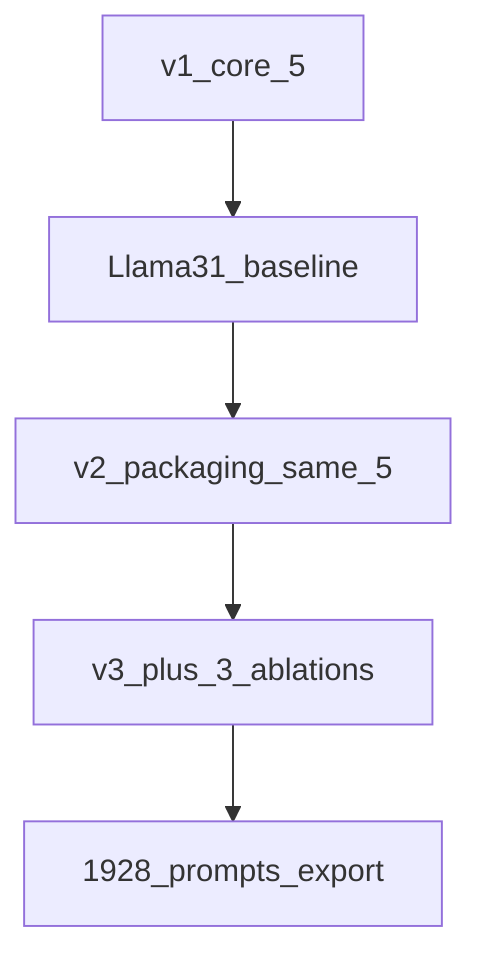

**Code:** [`src/ca_personas/personas.py`](../src/ca_personas/personas.py)  
**System contract:** [`prompts/system_prompt.md`](../prompts/system_prompt.md)  
**Examples:** [`prompts/examples/`](../prompts/examples/)

This page maps the three prompt generations used in the project. **All primary digital-twin claims in the manuscript are prompt-v1.** Versions 2–3 are **implemented in code** (signal-first packaging + three ablation tiers) and have been GPU-evaluated from the archived `exports/` packages. **v2** (v2_enhanced decode; Rogers GPU): Llama-3.1-8B-Instruct, Llama-3.2-3B-Instruct, and DeepSeek-R1-Distill-Llama-8B (5 tiers each). **v3** (greedy decode; 8 tiers): Llama-3.1-8B-Instruct, Llama-3.2-3B-Instruct, and Llama-3.3-70B-Instruct-AWQ (the 3.2 base had a 0% JSON parse and is excluded). The canonical `v3_enhanced` decode refresh remains pending.

---

## Version map

| Version | What changed | Tiers | Live LLM baseline |
|---|---|---:|---|
| **v1** | Original Terrarium core ladder; high-precision lat/lon; rides-per-day even when Never; fused CA ask | 5 (`demos`→`full`) | **Yes** — [Llama-3.1 report](llm_baseline_llama31_v1.md) (+ three sibling models) |
| **v2 (v3.1 packaging)** | Same 5 fields/topology; signal-first packaging (1-decimal geo, skip intensity when Never, independent-subscale ask, light system calibration) | 5 | **Yes** — [Llama-3.1-8B](../exports/v2/psych755_vllm_llama31_8b_instruct_v2_full_cohort_20260728_2214/) + [Llama-3.2-3B-Instruct](../exports/v2/psych755_vllm_llama32_3b_instruct_v2_full_cohort_20260728_2353/) + [DeepSeek-R1-Distill-8B](../exports/v2/psych755_vllm_deepseek_r1_distill_llama8b_v2_full_cohort_20260730_2213/) (v2_enhanced) |
| **v3** | Keeps v2 packaging; adds three parallel ablations on the demos→employment→geo base | **8** | **Greedy** — [Llama-3.1](../exports/v3/psych755_vllm_llama31_8b_instruct_v3_full_cohort_20260729_1039/), [Llama-3.2-3B-Instruct](../exports/v3/psych755_vllm_llama32_3b_instruct_v3_full_cohort_20260729_1039/), [Llama-3.3-70B](../exports/v3/psych755_vllm_llama33_70b_instruct_awq_v3_full_cohort_20260729_1039/); canonical `v3_enhanced` refresh pending |

---

## Version 1 — baseline (published Llama-3.1)

Five cumulative tiers: `demos` → `employment` → `geo` → `transit` → `full`.

Full-cohort vLLM results (N = 241 × 5 = 1,205; 100% JSON parse):

- Best group MAE ≈ **5.68** (`transit`) — still worse than tabular floor (~4.49 Ridge)
- Interpersonal MAE **worsens** sharply at `transit` (4.67 → 8.17) via over-prediction
- Employment / geo add almost no lift

**Read the full tables and RQ verdicts:** [`llm_baseline_llama31_v1.md`](llm_baseline_llama31_v1.md).

---

## Version 2 — packaging (v3.1)

Same research fields and cumulative topology as v1. Changes are *how* cues are phrased:

| Layer | v2 change |
|---|---|
| `geo` | Approximate lat/lon at **1 decimal**; do not repeat country |
| `transit` | Q26 → Q28 → car; **skip** Q27/Q29 when frequency is Never |
| CA ask | Rate group vs interpersonal **independently**; mid-scale anchor |
| System | Non-deterministic use of context; independent subscales |

Details: [`persona_prompt_efficiency.md`](persona_prompt_efficiency.md).

---

## Version 3 — ablations (+3 tiers)

Adds focused tips that disaggregate the kitchen-sink `transit`/`full` bundles:

| Tier | Tip | Scientific role |
|---|---|---|
| `v3_rideshare` | Q28 (+ Q29 if used) | Isolate #1 tabular CA covariate |
| `v3_public_transit` | Q26 (+ Q27 if used) | Isolate public-transit CA association without rideshare/car |
| `v3_voice` | Q18.1 / Q19 only | Isolate open-text attitude lift without transit dump |

`RESEARCH_TIERS` remains the original four for primary RQ tables. Default `build-personas` / vLLM export emit all **eight** tiers (241 × 8 = **1,928** prompts).

---

## What the v2/v3 GPU runs found

v2 (v2_enhanced decode) and v3 (greedy, 8-tier ablation) results are evaluated from the archived `exports/` packages (see [variant write-up](llm_v2_v3_enhanced_variants.md)):

| Prompt version | Llama-3.1-8B | Llama-3.2-3B-Instruct | DeepSeek-R1-Distill-8B | Llama-3.3-70B |
|---|---|---|---|---|
| **v1** (pooled G / IP) | 5.92 / 5.82 | 5.51 / **5.35** | **5.22** / 5.73 | 6.02 / 4.65† |
| **v2** (pooled G / IP) | 5.99 / 7.63 | 5.73 / 6.07 | **5.02** / **5.26** | — |
| **v3** (pooled G / IP, 8 tiers) | 5.99 / 5.76 | 5.72 / 6.81 | — | 6.01 / 4.61† |

† Llama-3.3-70B runs near a constant prior `(18, 12)` — mode collapse, not person-tracking.

**Verdicts against the v1 Llama baseline:**

1. **Does v2 packaging stop IP exploding at `transit`/`full`?** *No for Llama-3.1.* Transit IP 8.23 (v1: 8.17) and the base demos IP actually worsens (4.67 → 8.45). Llama-3.2-3B and DeepSeek show no collapse in v1 or v2; DeepSeek *improves* under v2 (IP 5.26, transit 5.09).
2. **Does `v3_rideshare` beat `v3_public_transit` (and approach full `transit`) on group MAE?** *Yes for Llama-3.1.* `v3_rideshare` group MAE 5.86 < `v3_public_transit` 6.04 < `transit` 6.07 — the Q28-only tip is the best group-CA tier, matching tabular Q28 dominance.
3. **Does `v3_voice` help without the transit interpersonal penalty?** *Yes.* Llama-3.1 `v3_voice` IP MAE 5.82 and group 5.64 vs `transit` 7.77 / 6.07; open-text voice is not the collapse driver.
4. **Is the Llama-3.1 collapse combination-specific?** *Yes.* Single-cue tiers are stable (IP 4.85–5.92); only the bundled mobility dump collapses IP (7.77).

The remaining gap to classical ML is unchanged (best live group MAE = DeepSeek v2 **5.02** vs Ridge **4.49**). Stereotyping MAE gaps per version still need `ca-personas stereotype-eval` on the packaged `02_evaluation_rowlevel.csv` outputs.
