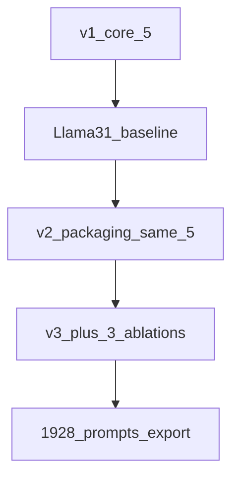

**Code:** [`src/ca_personas/personas.py`](../src/ca_personas/personas.py)  
**System contract:** [`prompts/system_prompt.md`](../prompts/system_prompt.md)  
**Examples:** [`prompts/examples/`](../prompts/examples/)

This page maps the three prompt generations used in the project. Live Llama-3.1 inference on the full cohort has been published for **version 1** only; versions 2–3 change packaging and add ablations so a re-run can test whether the v1 failure modes shrink.

---

## Version map

| Version | What changed | Tiers | Live LLM baseline |
|---|---|---:|---|
| **v1** | Original Terrarium core ladder; high-precision lat/lon; rides-per-day even when Never; fused CA ask | 5 (`demos`→`full`) | **Yes** — [Llama-3.1 report](llm_baseline_llama31_v1.md) |
| **v2 (v3.1 packaging)** | Same 5 fields/topology; signal-first packaging (1-decimal geo, skip intensity when Never, independent-subscale ask, light system calibration) | 5 | Pending re-run |
| **v3** | Keeps v2 packaging; adds three parallel ablations on the demos→employment→geo base | **8** | Pending re-run |

---

## Version 1 — baseline (published Llama-3.1)

Five cumulative tiers: `demos` → `employment` → `geo` → `transit` → `full`.

Full-cohort vLLM results (N = 241 × 5 = 1,205; 100% JSON parse):

- Best group MAE ≈ **5.68** (`transit`) — still worse than tabular floor (~4.49 Ridge)
- Interpersonal MAE **worsens** sharply at `transit` (4.67 → 8.17) via over-prediction
- Employment / geo add almost no lift

**Read the full tables and RQ verdicts:** [`llm_baseline_llama31_v1.md`](llm_baseline_llama31_v1.md).

---

## Version 2 — packaging (v3.1)

Same research fields and cumulative topology as v1. Changes are *how* cues are phrased:

| Layer | v2 change |
|---|---|
| `geo` | Approximate lat/lon at **1 decimal**; do not repeat country |
| `transit` | Q26 → Q28 → car; **skip** Q27/Q29 when frequency is Never |
| CA ask | Rate group vs interpersonal **independently**; mid-scale anchor |
| System | Non-deterministic use of context; independent subscales |

Details: [`persona_prompt_efficiency.md`](persona_prompt_efficiency.md).

---

## Version 3 — ablations (+3 tiers)

Adds focused tips that disaggregate the kitchen-sink `transit`/`full` bundles:

| Tier | Tip | Scientific role |
|---|---|---|
| `v3_rideshare` | Q28 (+ Q29 if used) | Isolate #1 tabular CA covariate |
| `v3_public_transit` | Q26 (+ Q27 if used) | Isolate public-transit CA association without rideshare/car |
| `v3_voice` | Q18.1 / Q19 only | Isolate open-text attitude lift without transit dump |

`RESEARCH_TIERS` remains the original four for primary RQ tables. Default `build-personas` / vLLM export emit all **eight** tiers (241 × 8 = **1,928** prompts).

---

## How to read future re-runs

Against the [v1 Llama baseline](llm_baseline_llama31_v1.md):

1. Does v2 packaging stop interpersonal MAE exploding at `transit`/`full`?
2. Does `v3_rideshare` beat `v3_public_transit` (and approach full `transit`) on group MAE?
3. Does `v3_voice` help without the transit interpersonal penalty?
4. Do Sex / Employment / Student MAE gaps remain measurable (stereotyping RQ)?
