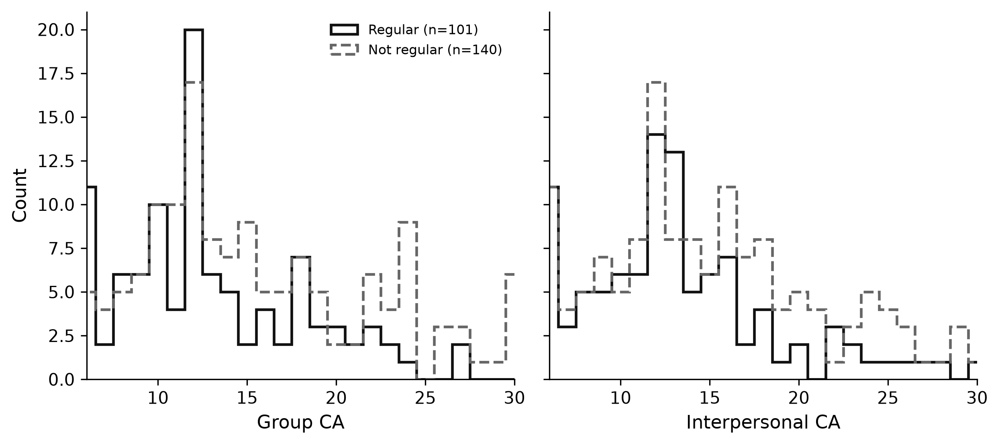
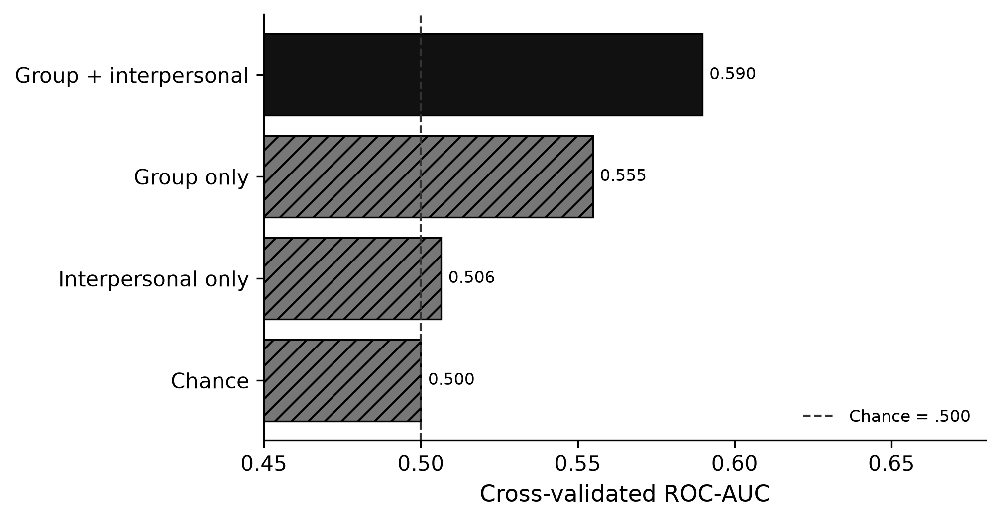

**Project:** PSYCH 755 — CA persona / PRCA framework  
**Analysis code:** [`src/ca_personas/ca_transit_rf.py`](../src/ca_personas/ca_transit_rf.py)  
**Notebook:** [`notebooks/secondary_rq_ca_transit_rf.ipynb`](../notebooks/secondary_rq_ca_transit_rf.ipynb)  
**CLI:** `ca-personas ca-transit-rf --join inner`  
**Artifacts:** `outputs/ca_transit_rf/`  
**Companion memo:** [`memos/ca_scores_predict_transit.md`](../memos/ca_scores_predict_transit.md)

---

## 1. Research question

Among Prolific↔Qualtrics **matched** respondents with complete PRCA ground truth, do **group** and **interpersonal** communication-apprehension (CA) scores predict whether an individual takes **public transportation regularly**?

This question reverses the predictive direction of the persona-tier work (where transit is an *input* to CA prediction) and complements the observational contrast in [`secondary_rq_transit_ca.md`](secondary_rq_transit_ca.md) (where we tested mean CA differences by transit group). Here we ask how much **out-of-sample classification signal** CA carries for the binary transit outcome.

## 2. Methods

### 2.1 Sample

- **Sources:** Prolific File A + File B (stacked) joined to Qualtrics File C on `Q0` ↔ `Participant id`
- **Analytic N:** 241 respondents with complete PRCA group + interpersonal items and usable `Q26`
- **Class balance:** 101 regular (41.9%) / 140 not regular (58.1%)

### 2.2 Outcome

**Regular public transit** = `Q26` ∈ {`4-8 days a month`, `8 or more days a month`} (weekly-or-more), matching the project’s primary transit operationalization.

Survey stem: *In the last three months on how many days did you use public transportation (bus, train, tram, etc.)?*  
(Closed choices are labeled in “days a month” units.)

### 2.3 Features

| Feature | Meaning | Range |
|---|---|---|
| `gt_group_ca` | Ground-truth PRCA group-discussion subscale | 6–30 |
| `gt_interpersonal_ca` | Ground-truth PRCA interpersonal subscale | 6–30 |

### 2.4 Model & evaluation

- **Estimator:** `RandomForestClassifier` (500 trees, `min_samples_leaf=3`, `class_weight="balanced"`), features z-scored in a pipeline
- **Validation:** stratified 5-fold CV; out-of-fold predicted probabilities
- **Primary metrics:** ROC-AUC, average precision, balanced accuracy, F1, Brier score
- **Comparators:**
  - Chance / prevalence baseline (ROC-AUC = 0.5)
  - Group-CA-only RF
  - Interpersonal-CA-only RF
- **Interpretation aids:** point-biserial associations, Gini + permutation importance, probability surface over CA space

## 3. Results



### 3.1 Descriptive associations

Regular riders report **lower** CA than non-regular riders on both subscales:

| Subscale | Regular M | Not-regular M | Δ (reg − not) | Point-biserial *r* | *p* |
|---|---:|---:|---:|---:|---:|
| Group CA | 13.04 | 15.76 | **−2.72** | −0.223 | 0.0005 |
| Interpersonal CA | 13.31 | 15.04 | **−1.73** | −0.147 | 0.023 |

Both associations are statistically significant at α = .05. The group subscale shows the larger mean gap and stronger correlation with regular transit.

### 3.2 Random Forest predictive performance



| Model | ROC-AUC | Avg. precision | Balanced accuracy | F1 |
|---|---:|---:|---:|---:|
| **Group + interpersonal RF** | **0.590** | 0.483 | 0.573 | 0.540 |
| Group CA only | 0.555 | — | — | — |
| Interpersonal CA only | 0.506 | — | — | — |
| Chance / prevalence | 0.500 | 0.419 | 0.500 | — |

At a 0.5 probability threshold, the primary model’s out-of-fold confusion counts were TN=76, FP=64, FN=40, TP=61.

### 3.3 Which subscale matters more?

- Single-feature AUCs and permutation importance both rank **group CA** above interpersonal CA.
- Combining both subscales lifts ROC-AUC by about **+0.035** over the better single-feature model (group only).

## 4. Interpretation

**Yes — CA scores carry above-chance predictive information about regular public-transit use in this matched cohort (CV ROC-AUC = 0.590).**

1. **Direction.** Higher communication apprehension is associated with *lower* probability of weekly+ public transit. Regular riders sit roughly 1.7–2.7 PRCA points lower than non-regular riders, with the larger gap on the **group** subscale.

2. **Magnitude of predictive power.** A CV ROC-AUC of **0.590** beats chance (0.50) but remains in a low-discrimination band relative to Q28 (0.762). CA alone is **not** a strong classifier of transit habits.

3. **Group vs interpersonal.** Group CA is the stronger of the two predictors. Adding interpersonal CA helps only slightly.

4. **Link to other secondary RQs.**
   - RQ1–3 ([`transit_ca`](secondary_rq_transit_ca.md)): established that regular riders differ in mean CA; this RQ shows that difference translates into **weak out-of-sample classification signal**.
   - RQ4 ([`geo_transit_rf`](secondary_rq_geo_predicts_transit.md)): lat/long alone yielded ROC-AUC = 0.5511. CA subscales here yield a similar (slightly higher) AUC = 0.5900.

5. **Implication for the primary persona project.** When LLM persona tiers include transit information, the model is being given a cue that is empirically (if weakly) related to true CA.

## 5. Limitations

1. **Same-wave association.** CA and transit were collected together; reverse causality and third-variable confounding remain plausible.
2. **Coarse outcome.** Weekly+ vs not discards ridership intensity within the regular group.
3. **Self-report.** Both PRCA and `Q26` are self-reported.
4. **External validity.** Results describe this Prolific/Qualtrics matched cohort only.

## 6. Reproducibility

```bash
ca-personas ca-transit-rf --join inner
jupyter nbconvert --to notebook --execute notebooks/secondary_rq_ca_transit_rf.ipynb
```

Key outputs:

- `outputs/ca_transit_rf/ca_transit_rf_results_card.json` — compact verdict for slides
- `outputs/ca_transit_rf/ca_transit_rf_metrics.csv` — full metric table
- `outputs/ca_transit_rf/fig_*.png` — presentation figures
