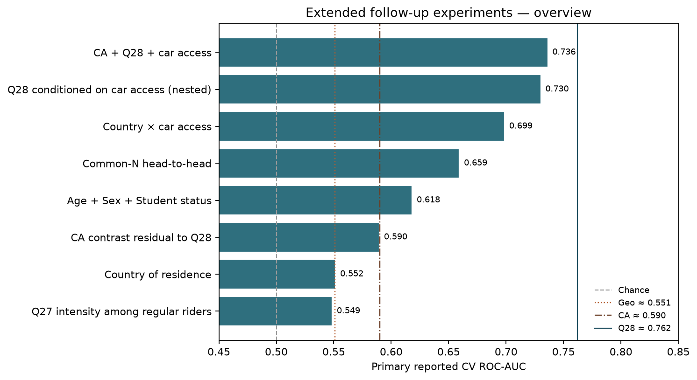

**Project:** PSYCH 755 — CA persona / PRCA framework  
**Analysis code:** [`src/ca_personas/followup_experiments.py`](../src/ca_personas/followup_experiments.py)  
**CLI:** `ca-personas followup-experiments --join inner --seed 42`  
**Artifacts:** `outputs/followup_experiments/`  
**Agenda:** [`docs/research_memo_agenda.md`](research_memo_agenda.md)  
**Notebook:** [`notebooks/secondary_rq_followup_experiments.ipynb`](../notebooks/secondary_rq_followup_experiments.ipynb)

---

## Motivation

Wave-1 secondary memos left specific uncertainties: unused Prolific demographics, country vs coordinates, whether **Q28** survives conditioning on car access, whether **CA** adds signal beside mobility items, country×car interactions, Q27 usefulness *within* regular riders, fair common-*N* rankings, residual CA after ride-share stratification, and whether **multiple imputation** would restore demos/CA or attenuate Q28. Wave 2 implements nine offline experiments on the same matched cohort.

## Shared methods

| Piece | Detail |
|---|---|
| Sample | File A + File B inner-joined to File C; base analytic n = 241 |
| Outcome | `regular_transit` = `Q26` ∈ {`4-8 days a month`, `8 or more days a month`} (except Q27-among-riders) |
| Estimators | Balanced RF (500 trees, `min_samples_leaf=3`), stratified CV, seed 42 |
| Mixed features | `ColumnTransformer` with scaled numerics + one-hot categoricals |
| Benchmarks | Chance 0.500 · geo ≈ 0.551 · CA ≈ 0.590 · Q28 ≈ 0.762 |

## Results overview (seed 42)

| Experiment | Analytic n | Primary ROC-AUC | Interpretation |
|---|---:|---:|---|
| MI joint CA+Q28+car | 241 | **0.808** | Best MI joint; Q28 singleton lead preserved |
| CA + Q28 + car (joint CC) | 149 | **0.736** | Best joint complete-case model; mobility-dominated |
| Q28 \| car (nested Q28+Q21) | 149 | **0.730** | Q28 retains lift; car adds incremental AUC |
| Country + car | 149 | **0.699** | Synergy over either alone |
| Common-*N* head-to-head (best = Q28) | 139 | **0.659** | Ranking robust to equal missingness |
| Demographics (Age+Sex+Student) | 224 | **0.618** | Modest; Age drives signal |
| Residual CA (CA-only on Q28 frame) | 241 | **0.590** | CA alone unchanged; +0.021 over Q28 when added |
| Country only | 241 | **0.552** | Ties lat/long geo |
| Q27 intensity among regular riders | 95–101 | **0.549** | No useful within-rider intensity classifier |

## Experiment-by-experiment notes

### Demographics → transit

Younger tertile ≈ 57% regular vs older ≈ 25%. Permutation importance: Age ≫ Sex ≫ Student. Students are sparse (n=34) after cleaning `DATA_EXPIRED`.

### Country → transit

US 37% regular · UK 48% · Canada 60% (small n). AUC ≈ 0.552 matches the geo memo’s country-only baseline and lat/long RF—place labels and IP coordinates carry similar weak signal.

### Nested Q28 \| car (common n=149)

| Model | ROC-AUC |
|---|---:|
| Q28 + Q21 | **0.730** |
| Q28 + Q20 + Q21 | 0.727 |
| Q28 only | 0.665 |
| Q21 only | 0.631 |

Q28 retains discrimination after car conditioning; car access adds ~0.07 AUC on the overlapping frame (where car items are non-missing).

### CA + Q28 + car

On the car-complete subset, **CA alone collapses** (AUC ≈ 0.47) while Q28 (0.665) and Q21 (0.631) remain useful. Joint model 0.736; permutation importance ranks Q28 > Q21 > interpersonal CA > group CA.

### Country × car

Additive country+car (0.699) slightly beats an explicit interaction feature (0.683) and clearly beats either alone.

### Q27 among regular riders

Among 101 weekly+ riders, 35 (34.7%) report high intensity (≥3–4 rides/day). No candidate family exceeds AUC ≈ 0.55; intensity is not recoverable from CA, Q28, car, employment, or demos in this subgroup.

### Common-*N* head-to-head (n=139)

Equal-complete-case ranking: **Q28 (0.659) > country (0.619) > car (0.602) > geo (0.573) > employment (0.533) > CA (0.517) > demographics (0.511)**. Wave-1 “rideshare wins” is not an artifact of unequal *N*.

### Residual CA after Q28

Overall transit→CA contrast replicates (group Δ ≈ −2.72, *p* < .001). Nested RF: Q28 AUC 0.762 → CA+Q28 0.783 (**+0.021**). Within Q28 strata, CA differences are heterogeneous (significant in Never and 0–1 days; near zero in 2–4 days).

### Multiply-imputed vs complete-case head-to-head

M = 20 imputations of Q20/Q21/Student on n = 241. **Singleton MI order:** Q28 (0.762) ≫ demos (0.617) ≫ CA (0.590) ≳ car (0.562). Demographics/CA are not restored to competitive levels; Q28’s lead is not attenuated. Joint CA+Q28+car rises to **0.808** when car items are MI-filled on the full frame; standalone car weakens under MI (−0.045). See [`memos/mi_head_to_head.md`](../memos/mi_head_to_head.md).

## Implications for persona tiers

1. Ride-share days remain the dominant tabular mobility cue—even after car conditioning, common-*N* equalization, and multiple imputation of car/student items.  
2. Demographics (especially age) deserve attention in bias audits of the `demos` tier.  
3. Country and lat/long are interchangeable weak place cues.  
4. CA’s association with regular transit is largely redundant with Q28 for *prediction*, though the mean CA gap among riders remains descriptively real.  
5. Q27 intensity is not a useful secondary target among already-regular riders.  
6. MI expands joint mobility models to full *N* without letting demos/CA overtake Q28 as singletons.

## Limitations

Complete-case shrinkage for car items (~149 / 139); MI assumes MAR given auxiliaries and uses simple code-rounding for categoricals; same-wave self-reports; convenience sample; AUCs are ranking metrics, not decision thresholds; within-stratum Welch tests are exploratory and underpowered in sparse Q28 cells.
