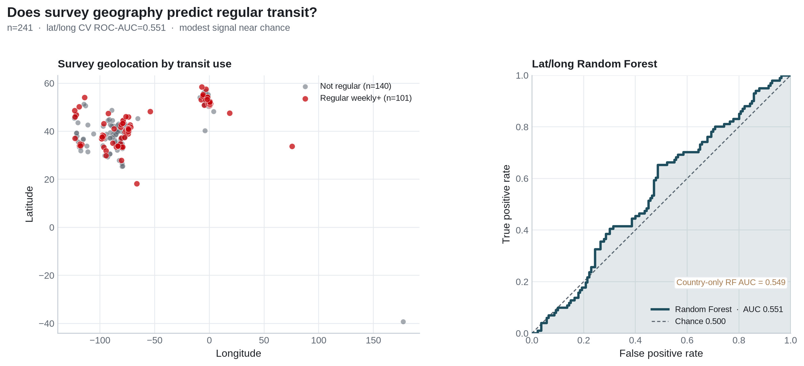
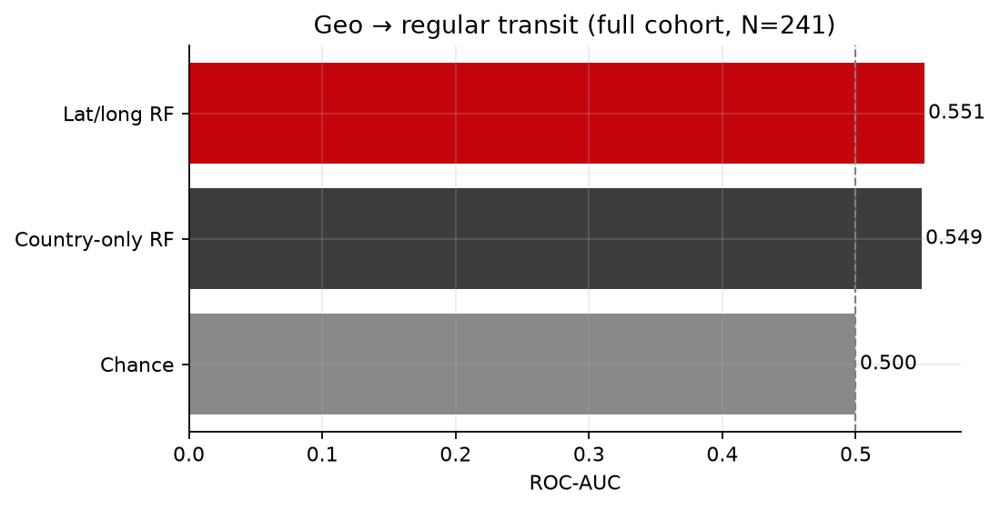

**Project:** PSYCH 755 — CA persona / PRCA framework  
**Analysis code:** [`src/ca_personas/geo_transit_rf.py`](../src/ca_personas/geo_transit_rf.py)  
**Notebook:** [`notebooks/secondary_rq_geo_transit_rf.ipynb`](../notebooks/secondary_rq_geo_transit_rf.ipynb)  
**CLI:** `ca-personas geo-transit-rf --join inner`  
**Artifacts:** `outputs/geo_transit_rf/`  
**Companion memo:** [`memos/geo_predicts_transit.qmd`](../memos/geo_predicts_transit.qmd)

---

## Research question

Among Prolific↔Qualtrics **matched** respondents with complete PRCA ground truth, do Qualtrics survey **latitude and longitude** predict whether an individual takes **public transportation regularly**?

This complements the observational CA contrast (`secondary_rq_transit_ca`) and the CA→transit RF (`secondary_rq_ca_transit_rf`) by asking how much **place** alone classifies the same binary transit outcome.

## Methods

### Sample

- **Sources:** Prolific File A + File B (stacked) joined to Qualtrics File C
- **Analytic N:** 241 with complete PRCA items and non-missing `LocationLatitude` / `LocationLongitude`
- **Class balance:** 101 regular (41.9%) / 140 not regular (58.1%)

### Outcome & features

| Piece | Detail |
|---|---|
| Outcome | Regular transit = `Q26` ∈ {`4-8 days a month`, `8 or more days a month`} |
| Features | `LocationLatitude`, `LocationLongitude` (approximate IP/browser geolocation) |
| Model | Balanced `RandomForestClassifier` (500 trees, `min_samples_leaf=3`), features z-scored |
| Validation | Stratified 5-fold CV; out-of-fold probabilities |
| Baselines | Chance (ROC-AUC = 0.50); country-of-residence-only RF |

## Results



**Spatial descriptives.** Regular and non-regular riders overlap heavily in lat/lon space:

| Group | n | Mean lat | Mean lon |
|---|---:|---:|---:|
| Regular | 101 | 43.05 | −62.00 |
| Not regular | 140 | 41.10 | −69.07 |



### Predictive performance

| Model | ROC-AUC |
|---|---:|
| Latitude + longitude RF | **0.551** |
| Country-of-residence RF | 0.549 |
| Chance / prevalence | 0.500 |

Permutation importance ranks **longitude** (mean AUC drop = 0.335) above **latitude** (0.260). Continuous coordinates lift AUC by only **+0.002** over a country-only forest (0.551 − 0.549) — essentially no gain beyond coarse country membership.

## Interpretation

**Geography, as captured by Qualtrics lat/long, recovers CV ROC-AUC = 0.551 in this sample** ([memo](../memos/geo_predicts_transit.qmd)).

1. Discrimination is above chance (+0.051) but remains near the country-only baseline (0.549).
2. Nearly all of that signal is redundant with **country of residence**.
3. Compared with the CA→transit RF (AUC = 0.590; [memo](../memos/ca_scores_predict_transit.qmd)), place alone is a weaker classifier; Q28 recovers AUC = 0.762 ([memo](../memos/q27_q28_predict_transit.qmd)).
4. For the primary persona project, the `geo` tier supplies a coarse place cue that may help CA prediction indirectly (via country / urbanicity correlates) but should not be treated as a precise transit-accessibility measure.

## Limitations

1. Qualtrics coordinates are approximate IP/browser locations, not verified home addresses.
2. Country composition and urbanicity may confound continuous lat/long effects.
3. Observational association ≠ causal effect of place on transit use.
4. External validity limited to this matched cohort.

## Reproducibility

```bash
ca-personas geo-transit-rf --join inner
jupyter nbconvert --to notebook --execute notebooks/secondary_rq_geo_transit_rf.ipynb
```

Key outputs: `outputs/geo_transit_rf/geo_transit_rf_results_card.json`, `geo_transit_rf_metrics.csv`, `fig_*.png`.
