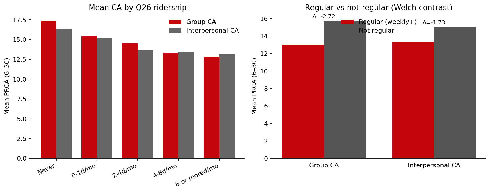

**Project:** PSYCH 755 — CA persona / PRCA framework  
**Analysis code:** [`src/ca_personas/transit_ca.py`](../src/ca_personas/transit_ca.py)  
**Notebook:** [`notebooks/secondary_rq_transit_ca.ipynb`](../notebooks/secondary_rq_transit_ca.ipynb)  
**CLI:** `ca-personas transit-ca --join inner`  
**Artifacts:** `outputs/transit_ca/`  
**Companion memo:** [`memos/transit_riders_ca.md`](../memos/transit_riders_ca.md)

---

## 1. Research questions

On the Prolific↔Qualtrics **matched** analytic sample (no LLM):

1. Do individuals who take public transportation **regularly** differ in **group** CA from non-regular riders?
2. Do they differ in **interpersonal** CA?
3. How large are those differences relative to the overall cohort mean, and are they sensitive to the `Q26` cutoff used to define “regular”?

These questions establish the descriptive association that later predictive models (CA→transit RF; geo→transit RF) quantify out of sample.

## 2. Methods

### 2.1 Sample

- **Sources:** Prolific File A + File B (stacked) joined to Qualtrics File C on `Q0` ↔ `Participant id`
- **Analytic N:** 241 respondents with complete PRCA group + interpersonal items
- **Exposure labeled N:** 241 with usable `Q26` (101 regular / 140 not regular)

### 2.2 Exposure

**Regular public transit** = `Q26` ∈ {`4-8 days a month`, `8 or more days a month`} (weekly-or-more).

### 2.3 Outcomes & tests

| Piece | Detail |
|---|---|
| Outcomes | `gt_group_ca`, `gt_interpersonal_ca` (PRCA 6–30) |
| Primary test | Welch *t* (unequal variances) |
| Sensitivity | Mann–Whitney *U*; bootstrap 95% CI for mean difference |
| Effect size | Cohen's *d*, Hedges' *g* |
| Extra contrasts | Regular mean vs overall cohort mean; alternate `Q26` cutoffs |

## 3. Results

### 3.1 Primary contrast (regular vs not-regular)


| Subscale | Regular M | Not-regular M | Δ (reg − not) | Welch *p* | Cohen's *d* | Bootstrap 95% CI |
|---|---:|---:|---:|---:|---:|---|
| Group CA | 13.04 | 15.76 | **−2.72** | 0.0003 | −0.46 | [−4.15, −1.28] |
| Interpersonal CA | 13.31 | 15.04 | **−1.73** | 0.020 | −0.30 | [−3.12, −0.25] |

Both subscales differ significantly at α = .05. Group CA shows the larger mean gap (small–medium *d*); interpersonal CA is a small effect.



Relative to the **overall** cohort mean (group 14.62; interpersonal 14.31), regular riders sit about **−1.58** / **−1.00** PRCA points lower (−10.8% / −7.0%).

### 3.2 Gradient by ridership intensity

Mean CA falls roughly monotonically as `Q26` ridership increases:

| Q26 | n | Mean group CA | Mean interpersonal CA |
|---|---:|---:|---:|
| Never | 50 | 17.38 | 16.34 |
| 0–1 days/month | 37 | 15.38 | 15.16 |
| 2–4 days/month | 53 | 14.51 | 13.72 |
| 4–8 days/month | 46 | 13.28 | 13.48 |
| 8+ days/month | 55 | 12.84 | 13.16 |

“Never” riders are the high-CA pole; weekly+ riders are the low-CA pole.

### 3.3 Sensitivity

Alternate definitions of “regular” (e.g., 8+ only vs weekly+) preserve the **direction** of the group-CA gap; magnitude and *p*-values shift with class balance. The weekly+ operationalization used elsewhere in the project is retained as the primary cut.

## 4. Interpretation

**Yes — regular public-transit riders report lower communication apprehension than non-regular riders in this matched cohort.**

1. **Direction.** Higher CA ↔ less weekly+ transit, on both subscales, with a clearer signal for **group** discussion anxiety.
2. **Magnitude.** Effects are small-to-medium, not categorical: many high-CA respondents still ride, and many low-CA respondents do not.
3. **Link to other secondary RQs.** Mean differences here become the weak out-of-sample classification signal in the CA→transit Random Forest (ROC-AUC ≈ 0.59) and sit beside a similarly modest geo→transit AUC (≈ 0.55).
4. **Implication for persona tiers.** When LLM prompts include transit frequency, they receive a cue that is empirically associated with true CA — so transit is a legitimate (if weak) contextual feature, not an arbitrary demographic tag.

## 5. Limitations

1. Same-wave association; causality (anxiety → avoid transit, transit → reduce anxiety, or third variables) cannot be separated.
2. Self-report for both PRCA and `Q26`.
3. Weekly+ threshold discards intensity within the regular group.
4. Results describe this Prolific/Qualtrics matched cohort only.

## 6. Reproducibility

```bash
ca-personas transit-ca --join inner
jupyter nbconvert --to notebook --execute notebooks/secondary_rq_transit_ca.ipynb
```

Key outputs: `outputs/transit_ca/transit_ca_results_card.json`, `transit_ca_comparisons.csv`, `transit_ca_by_q26.csv`.
