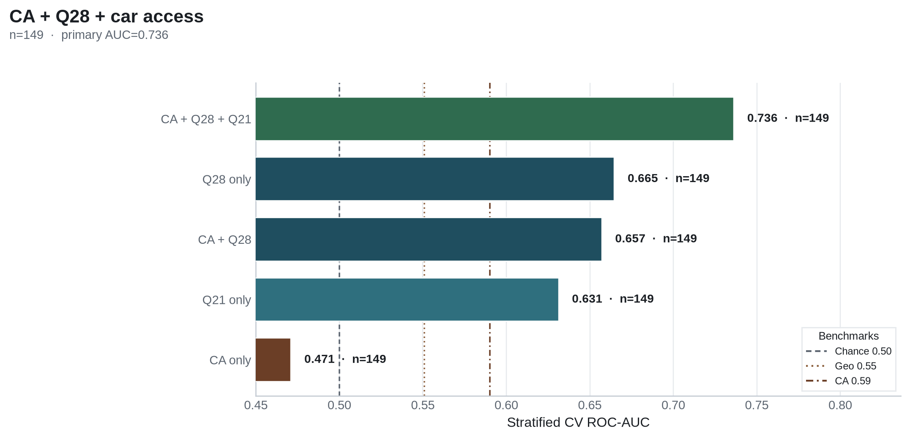

**Research question:** On a complete-case frame, how do group/interpersonal **CA**, ride-share days (**Q28**), and car access (**Q21**) jointly and separately predict regular transit?

**Companions:** [`ca_scores_predict_transit.md`](ca_scores_predict_transit.md) · [`q28_conditioned_on_car.md`](q28_conditioned_on_car.md) · [`residual_ca_after_rideshare.md`](residual_ca_after_rideshare.md)

---

## Answer, Response, + Summary of Results

Complete cases for CA + Q28 + Q21 yield n = **149**. Nested mixed Random Forests on this shared frame (`seed=42`):

**Short answer:** The **joint model is strong** (AUC ≈ **0.736**), but it is a **mobility model**—Q28 and Q21 dominate. CA alone on this subset is *below chance* (≈ **0.471**), showing how sample restriction and mobility overlap can erase the modest full-cohort CA signal (≈0.590 on n=241).

### Nested CV performance (common n = 149)

| Model | ROC-AUC |
|---|---:|
| **CA + Q28 + Q21** | **0.736** |
| Q28 only | 0.665 |
| CA + Q28 | 0.657 |
| Q21 only | 0.631 |
| CA only | **0.471** |
| Chance | 0.500 |

Permutation importance (joint model): Q28 ≈ 0.20 · Q21 ≈ 0.14 · interpersonal CA ≈ 0.08 · group CA ≈ 0.07.

### Interpretation

1. Answers the follow-ups memo’s psych-vs-mobility question **without multiple imputation**: mobility wins decisively on the overlapping frame.  
2. CA’s full-cohort AUC should not be compared naively to rideshare AUCs computed on different complete-case sets—**CA collapses when the sample is the car-complete subset**.  
3. Adding CA to Q28 alone does not beat Q28 (0.657 < 0.665); CA helps only once car access is also present (joint 0.736).

*Sources:* `ca-personas followup-experiments --experiments ca_q28_car` · `outputs/followup_experiments/ca_q28_car/`

---

## What questions or uncertainties remain?

Is the CA collapse on n=149 selection (who answers car items) or true redundancy with mobility? See also residual-CA strata in [`residual_ca_after_rideshare.md`](residual_ca_after_rideshare.md).
