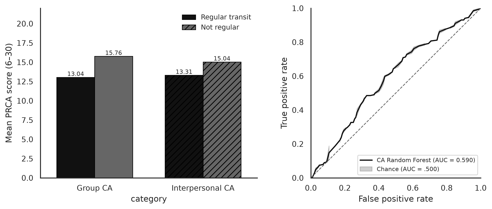

**Research question:** Do group and interpersonal communication-apprehension (PRCA) scores predict whether an individual takes public transportation regularly?

**Formal write-up:** [`docs/secondary_rq_ca_predicts_transit.md`](../docs/secondary_rq_ca_predicts_transit.md)

---

## Answer, Response, + Summary of Results

Using the Prolific↔Qualtrics matched cohort for this project (File A + File B stacked joined to File C on Prolific ID / `Q0`; **252** matched rows; analytic **n = 241** with complete scorable PRCA items and usable `Q26`), we asked whether ground-truth **group** and **interpersonal** CA scores (range 6–30) predict **regular** public-transit use, defined as `Q26` ∈ {`4–8 days a month`, `8 or more days a month`} (weekly-or-more). A balanced **Random Forest** ([@breiman2001]; implemented via scikit-learn [@pedregosa2011]) (stratified 5-fold CV, `random_state=42`) was trained on the two CA subscales, with group-only and interpersonal-only ablations and a chance baseline (ROC-AUC = **0.50**).

Figures below match the formal write-up [`docs/secondary_rq_ca_predicts_transit.md`](../docs/secondary_rq_ca_predicts_transit.md) and the seeded CLI artifacts under `outputs/ca_transit_rf/` (`ca-personas ca-transit-rf --join inner --seed 42`).

**Short answer:** Yes. Higher CA is associated with *lower* odds of regular transit, and a CA-only Random Forest recovers above-chance discrimination (CV ROC-AUC = **0.590**; group-only = **0.555**; interpersonal-only = **0.506**). Group CA is the larger contributor (permutation mean $\Delta$AUC = 0.309 vs 0.223). Figure @fig-ct-ca-predicts-transit shows the mean-CA gap alongside the Random Forest ROC curve.

{#fig-ct-ca-predicts-transit}

**Descriptive associations (regular vs not-regular).** Regular riders (n = 101) report lower CA than non-regular riders (n = 140):

- **Group CA:** *M* = **13.04** vs 15.76 (Δ = **−2.72**); point-biserial *r* = −0.223, *p* = 0.0005  
- **Interpersonal CA:** M = 13.31 vs 15.04 (Δ = **−1.73**); point-biserial *r* = −0.147, *p* = 0.023  

**Random Forest (stratified CV).** Predicting regular transit from CA scores (see Table @tbl-ct-1):

| Model | ROC-AUC |
|---|---:|
| Group + interpersonal CA | **0.590** |
| Group CA only | 0.555 |
| Interpersonal CA only | 0.506 |
| Chance | 0.500 |

: Random Forest ROC-AUC for CA scores predicting regular transit. {#tbl-ct-1}

Permutation importance likewise ranks **group CA** above interpersonal CA. Combining both subscales improves AUC by about +0.035 over the better single-feature model.

**Conclusion.** Group and interpersonal CA recover CV ROC-AUC = **0.590** for weekly+ transit — above chance (+0.090) and above geo (0.551), but below `Q28` (0.762; [`q27_q28_predict_transit.qmd`](q27_q28_predict_transit.qmd)). The relationship is consistent in direction (higher apprehension ↔ less weekly+ transit) and is driven more by **group** than interpersonal CA. CA alone does not separate riders cleanly (OOF confusion TN = 76, FP = 64, FN = 40, TP = 61), so treat these scores as a behavioral correlate, not a deterministic proxy.

*Sources:* `notebooks/secondary_rq_ca_transit_rf.ipynb` · `src/ca_personas/ca_transit_rf.py` · `ca-personas ca-transit-rf` · write-up `docs/secondary_rq_ca_predicts_transit.md` · [github.com/Exios66/psych755-jjb](https://github.com/Exios66/psych755-jjb)

---

## What questions or uncertainties remain?

Is the CA–transit link causal (e.g., anxiety reducing use of shared vehicles), reverse (transit exposure reducing apprehension), or driven by third variables such as urbanicity, car access, employment, or country of residence? Same-wave self-reports cannot separate these accounts.

**Answered in follow-ups:** residual CA after stratifying on `Q28` is [`residual_ca_after_rideshare.qmd`](residual_ca_after_rideshare.qmd) (CA adds only +0.021 AUC over `Q28`); CA + `Q28` + car on a complete-case frame is [`ca_mobility_joint_predicts_transit.qmd`](ca_mobility_joint_predicts_transit.qmd) (joint 0.736); the multiply-imputed head-to-head is [`mi_head_to_head.qmd`](mi_head_to_head.qmd) (CA not restored to competitive levels).

## What other features may also well-predict regular public transit use?

Survey geolocation recovers AUC = **0.551** ([`geo_predicts_transit.qmd`](geo_predicts_transit.qmd)). Head-to-head mobility follow-ups: ride-share family `Q28`/`Q29` AUC = **0.745**, car access `Q20`/`Q21` AUC = **0.607**, employment AUC = **0.528**, `Q28` alone AUC = **0.762** — see [`transit_covariate_followups.qmd`](transit_covariate_followups.qmd) and [`q27_q28_predict_transit.qmd`](q27_q28_predict_transit.qmd).
