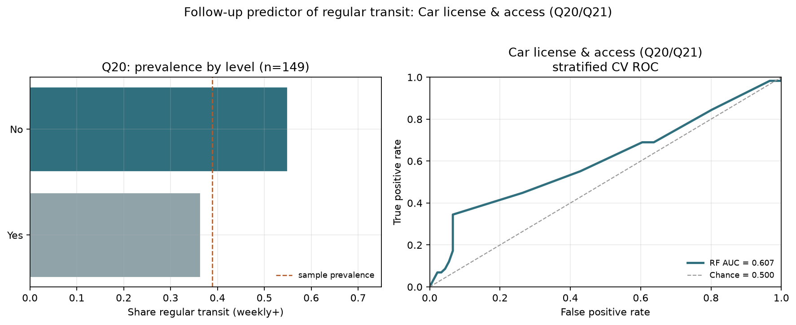

**Research question:** Do driver's license (`Q20`) and car access (`Q21`) predict whether a matched respondent takes public transportation regularly?

**Parent memo:** [`geo_predicts_transit.md`](geo_predicts_transit.md)  
**Comparison memo:** [`transit_covariate_followups.md`](transit_covariate_followups.md)

---

## Answer, Response, + Summary of Results

Using the Prolific↔Qualtrics matched cohort (File A + File B stacked joined to File C; analytic PRCA sample **n = 241**), we tested the geo-memo follow-up candidate **car license / car access**. Regular transit is `Q26` ∈ {`4-8 days a month`, `8 or more days a month`}. Because `Q20`/`Q21` are missing for many respondents, the complete-case modeling frame is **n = 149** (58 regular / 91 not regular; prevalence ≈ 38.9%). A balanced Random Forest with stratified 5-fold CV (`seed=42`) used `Q20` and `Q21` as one-hot features.

**Short answer:** Yes — modestly, and stronger than geography or CA alone. Car license/access recovers CV ROC-AUC ≈ **0.607**, above chance (0.500), the geo RF benchmark (≈ **0.551**), and the CA RF benchmark (≈ **0.590**). Access (`Q21`) dominates license (`Q20`).

**Descriptive associations (complete cases).** Respondents without car access ride regularly far more often than those with access:

| Item | Level | n | % regular |
|---|---|---:|---:|
| Q21 access | No | 25 | **76.0%** |
| Q21 access | Yes | 123 | 30.9% |
| Q20 license | No | 20 | 55.0% |
| Q20 license | Yes | 129 | 36.4% |

**Random Forest (stratified CV).**

| Model | n | ROC-AUC |
|---|---:|---:|
| Q20 + Q21 RF | 149 | **0.607** |
| CA RF benchmark | 241 | 0.590 |
| Geo RF benchmark | 241 | 0.551 |
| Chance | — | 0.500 |

Permutation importance ranks **Q21** (mean AUC drop ≈ 0.18) above **Q20**. At a 0.5 threshold the forest is conservative on the positive class (precision ≈ 0.77, recall ≈ 0.34, F1 ≈ 0.48), consistent with a sparse “no access” positive signal.

**Conclusion.** Car access is a **usable** but incomplete predictor of weekly+ transit in this sample: lacking a usable car is strongly associated with regular ridership, yet item missingness truncates the analytic *N*. Interpret as a mobility constraint correlate, not a causal estimate.

*Sources:* `notebooks/secondary_rq_car_access_transit_rf.ipynb` · `src/ca_personas/transit_covariate_rf.py` · `ca-personas covariate-transit-rf --specs car_access` · [github.com/Exios66/psych755-jjb](https://github.com/Exios66/psych755-jjb)

---

## What questions or uncertainties remain?

Are `Q20`/`Q21` missing systematically (e.g., skip logic, survey fatigue), and would imputed or survey-design-aware models change the AUC? Does car access mediate part of the CA–transit or geo–transit associations?

## What other features may also well-predict regular public transit use?

Ride-share frequency (`Q28`/`Q29`) is substantially stronger (AUC ≈ **0.745**). Employment status alone is weak (≈ **0.528**). See the head-to-head comparison memo.
