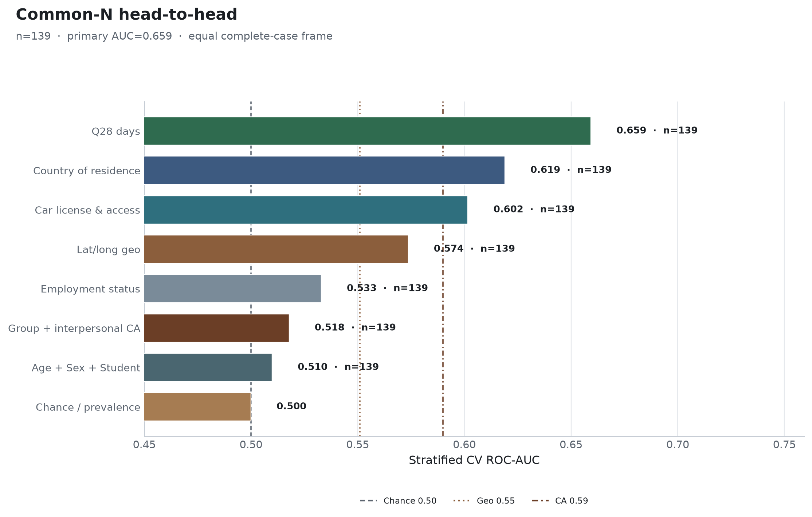

**Research question:** When every major predictor family is evaluated on the **same** complete-case subset, which features still rank highest for regular-transit discrimination?

**Motivation:** Wave-1 AUCs used unequal *N* (car ≈149; Q28 ≈241; employment ≈241). Ranking could be confounded by missingness.

---

## Answer, Response, + Summary of Results

Requiring complete Age, Sex, Student status, Country, Employment, Q20/Q21, Q28, CA scores, and lat/long yields n = **139** (56 regular; prevalence 40.3%). Each family is re-fit with stratified CV (`seed=42`) on this shared frame.

**Short answer:** **Q28 still wins** (AUC ≈ **0.659**). Country and car remain mid-tier. Geo is weak-modest. Employment, CA, and demographics fall near chance on this restricted overlap.

{#fig-cn2-common-n-followup}

### Equal-*N* CV ranking (n = 139)

| Feature family | ROC-AUC |
|---|---:|
| **Q28 days** | **0.659** |
| Country of residence | 0.619 |
| Car license & access | 0.602 |
| Lat/long geo | 0.573 |
| Employment status | 0.533 |
| Group + interpersonal CA | 0.517 |
| Age + Sex + Student | 0.511 |
| Chance / prevalence | 0.500 |

: Common-N fair ranking comparison. {#tbl-cn2-1}

### Interpretation

1. The wave-1 conclusion that **ride-share days dominate** is **not an artifact of unequal complete-case samples**.  
2. Absolute AUCs shrink versus full-cohort Q28 (0.762 → 0.659) because the overlap is smaller and more selected—but the **ordinal ranking** is stable.  
3. Demographics’ modest full-sample AUC (0.618) does not survive once the sample is the car/mobility-complete subset—selection matters for demography more than for Q28.

*Sources:* `ca-personas followup-experiments --experiments common_n` · `outputs/followup_experiments/common_n/`

---

## What questions or uncertainties remain?

Would a multiply-imputed analysis restore demographics/CA while preserving the Q28 lead, or would imputation attenuate rideshare’s advantage? — **Answered** in [`mi_head_to_head.md`](mi_head_to_head.qmd): Q28 singleton lead preserved; demos/CA not restored to competitive levels.
