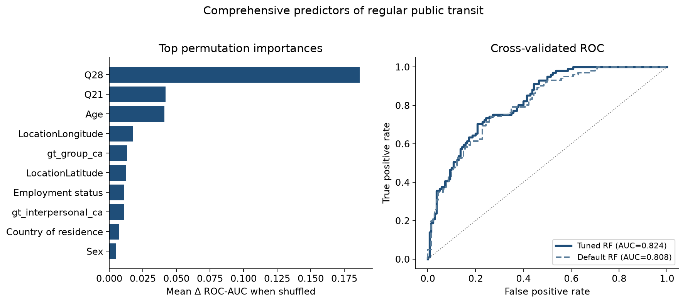

**Research question:** Among available survey fields in the matched Prolific↔Qualtrics cohort (excluding the outcome source itself), which predictors most powerfully discriminate whether an individual takes public transportation regularly, and what ROC-AUC can a tuned Random Forest achieve?

---

## Answer, Response, + Summary of Results

Using the Prolific↔Qualtrics matched cohort (File A + File B stacked joined to File C on Prolific ID / `Q0`; **252** matched rows; analytic **n = 241** with complete PRCA items and non-missing Qualtrics geolocation), we screened demographics, employment, survey latitude/longitude, car access (`Q20`/`Q21`), ride-share behavior (`Q28`/`Q29`), and ground-truth PRCA scores as predictors of **regular** public-transit use. Regular transit is defined as `Q26` ∈ {`4–8 days a month`, `8 or more days a month`} (weekly-or-more). `Q26` was never used as a predictor. A mixed-type **Random Forest** (median/most-frequent imputation, one-hot encoding, stratified 5-fold CV) was tuned with `RandomizedSearchCV` to maximize ROC-AUC. Feature importance was assessed via univariate AUC, feature-group ablations, and original-column permutation importance.

**Short answer:** Yes—combining mobility-adjacent and demographic fields yields **strong** discrimination. The tuned kitchen-sink forest reaches CV ROC-AUC = **0.824** (default RF = 0.808; chance = 0.500). **Ride-share frequency (`Q28`) is by far the dominant predictor**, followed by car access (`Q21`) and age.

{#fig-cp-comprehensive-predictors-transit}

**Univariate screen.** Fit alone, `Q28` already achieves AUC ≈ **0.762**. No other primary feature exceeds 0.58 alone (`Age` ≈ 0.580; `gt_group_ca` ≈ 0.555; lat/lon and country ≈ 0.55). Proximal `Q27` (rides on a typical public-transit day)—reserved for an upper-bound model—scores ≈ 0.594 univariate on the imputed n = 241 screen frame (cf. the seeded `Q27`-only model, AUC **0.589** on n = 239 in [`q27_q28_predict_transit.qmd`](q27_q28_predict_transit.qmd)).

**Feature-group ablations.**

| Model / comparison | ROC-AUC |
|---|---:|
| Rideshare group only (`Q28`, `Q29`) | **0.758** |
| Demographics only | 0.636 |
| CA scores only | 0.590 |
| Car access only | 0.563 |
| Geography only | 0.551 |
| Full kitchen sink (default RF) | 0.808 |
| Full kitchen sink (**tuned** RF) | **0.824** |
| Upper bound (+ `Q27`) | 0.827 |
| Chance / prevalence | 0.500 |

: Comprehensive predictor comparison for regular transit. {#tbl-cp-1}

Leave-one-group-out confirms the hierarchy: dropping **rideshare** costs ≈ **−0.103** AUC; dropping car access ≈ −0.027; dropping CA ≈ −0.014. Dropping geography does not hurt (and can slightly help), indicating lat/lon add little once other fields are present.

**Permutation importance (tuned model).** Shuffling `Q28` reduces ROC-AUC by ≈ ****0.187**** on average—several times larger than the next features (`Q21` ≈ 0.042; `Age` ≈ 0.041; longitude ≈ 0.018; `gt_group_ca` ≈ 0.013). Best hyperparameters favored a relatively shallow forest (`max_depth=4`, `max_features=log2`, `min_samples_leaf=2`, `class_weight=balanced`).

**Conclusion.** In this cohort, regular public-transit use is **most powerfully predicted by adjacent mobility behavior**—especially ride-share days per month—augmented by car access and age. Communication apprehension and approximate geolocation remain detectable but secondary once mobility covariates are included. A tuned Random Forest over the defensible kitchen-sink feature set achieves **strong** out-of-fold discrimination (ROC-AUC ≈ 0.82). Adding proximal transit-intensity item `Q27` yields only a marginal further lift, so the primary model already captures most available tabular signal without direct outcome leakage.

*Sources:* `notebooks/secondary_rq_comprehensive_transit_rf.ipynb` · `src/ca_personas/comprehensive_transit_rf.py` · `ca-personas comprehensive-transit-rf` · [github.com/Exios66/psych755-jjb](https://github.com/Exios66/psych755-jjb) · formal write-up [`docs/secondary_rq_followup_experiments.md`](../docs/secondary_rq_followup_experiments.md)

---

## What questions or uncertainties remain?

How much of the `Q28` signal reflects a shared “multi-modal traveler” lifestyle versus a substitute/complement relationship with public transit? Would urban density, transit-access scores, or income—unavailable here—displace ride-share once included? Car/license items have substantial missingness (~38%); would complete automobility data reorder the importance ranking?

## What other features may also well-predict regular public transit use?

City-level transit supply, commute distance, household vehicle count, and neighborhood density are natural next candidates. Within the present instrument, open-text mobility attitudes (`Q19`) and advice language (`Q18.1`) remain unused tabular/NLP features that could add signal beyond the structured kitchen sink.