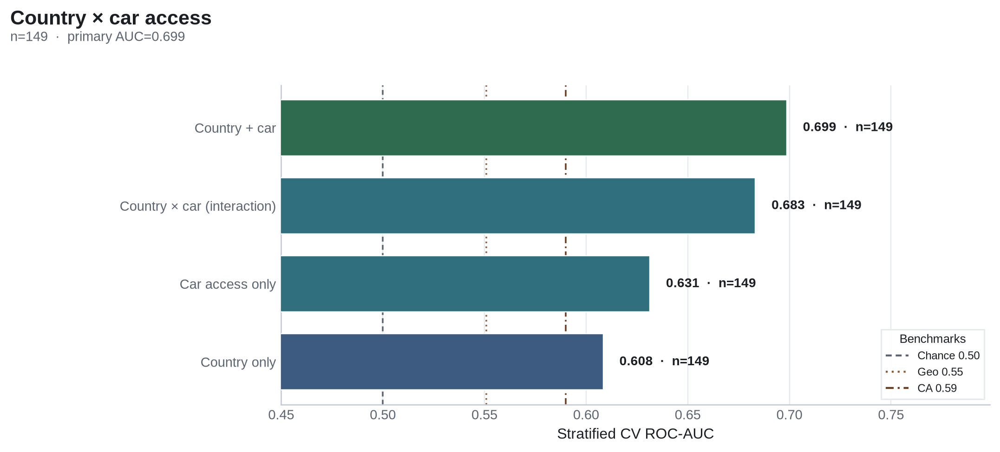

**Research question:** Do **country of residence** and **car access (Q21)** jointly—or as an interaction—predict regular public-transit use better than either alone?

**Parent open question:** [`transit_covariate_followups.md`](transit_covariate_followups.md) · **Companions:** [`country_predicts_transit.md`](country_predicts_transit.md) · [`car_access_predicts_transit.md`](car_access_predicts_transit.md)

---

## Answer, Response, + Summary of Results

On respondents with complete country + Q21 (n = **149**), nested categorical Random Forests (`seed=42`) show clear synergy.

**Short answer:** **Yes.** Country + car AUC ≈ **0.699**, beating car alone (0.631) and country alone (0.608). An explicit `country × car` interaction feature is similar but slightly weaker (0.683).

### Nested CV performance (common n = 149)

| Model | ROC-AUC |
|---|---:|
| **Country + car (additive)** | **0.699** |
| Country × car (interaction string) | 0.683 |
| Car access only (Q21) | 0.631 |
| Country only | 0.608 |
| Chance | 0.500 |

### Interpretation

1. Closes the follow-ups memo’s “country × car” open item: place and auto access are **complementary**, not redundant.  
2. Additive encoding is sufficient; a saturated interaction string does not buy more AUC in this sample.  
3. Still far below full-cohort Q28 (≈0.762), so country×car is a mid-tier place/mobility bundle—not a rideshare substitute.

*Sources:* `ca-personas followup-experiments --experiments country_car` · `outputs/followup_experiments/country_car/`

---

## What questions or uncertainties remain?

Would denser geography (metro area / transit agency coverage) interact with car access more sharply than coarse country labels?
