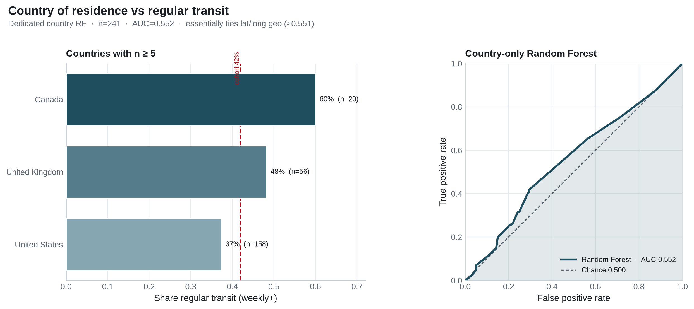

**Research question:** Does **country of residence** alone predict regular public-transit use, and how does it compare to Qualtrics lat/long geography?

**Parent memo:** [`geo_predicts_transit.md`](geo_predicts_transit.md) · **Companion:** [`country_car_predicts_transit.md`](country_car_predicts_transit.md)

---

## Answer, Response, + Summary of Results

On the full matched analytic cohort (n = **241**), a categorical Random Forest on `Country of residence` yields CV ROC-AUC ≈ **0.552**—essentially identical to the lat/long geo memo (≈ **0.551**) and the geo module’s country-only baseline (≈ 0.549).

**Short answer:** Country is a **weak place cue**, interchangeable with survey coordinates for this outcome. It does **not** unlock the discrimination that mobility items (especially Q28) provide.

### Prevalence by country (n ≥ 20)

| Country | n | % regular |
|---|---:|---:|
| United States | 158 | 37.3% |
| United Kingdom | 56 | 48.2% |
| Canada | 20 | 60.0% |

Remaining countries are singleton / tiny cells and should not be over-interpreted.

### Performance

| Model | n | ROC-AUC |
|---|---:|---:|
| **Country of residence** | 241 | **0.552** |
| Lat/long (geo memo) | 241 | 0.551 |
| CA benchmark | 241 | 0.590 |
| Chance | — | 0.500 |

### Interpretation

1. Answers the geo memo’s open question: **country vs raw coordinates are tied**, both barely above chance.  
2. Place labels alone cannot explain the stronger rideshare/car associations.  
3. Pairing country with car access *does* help—see [`country_car_predicts_transit.md`](country_car_predicts_transit.md).

*Sources:* `ca-personas followup-experiments --experiments country` · `outputs/followup_experiments/country/`

---

## What questions or uncertainties remain?

Would city-level or transit-infrastructure GIS features beat both country and IP lat/long? VPN/IP misplacement concerns from the geo memo still apply to the coordinate arm.
