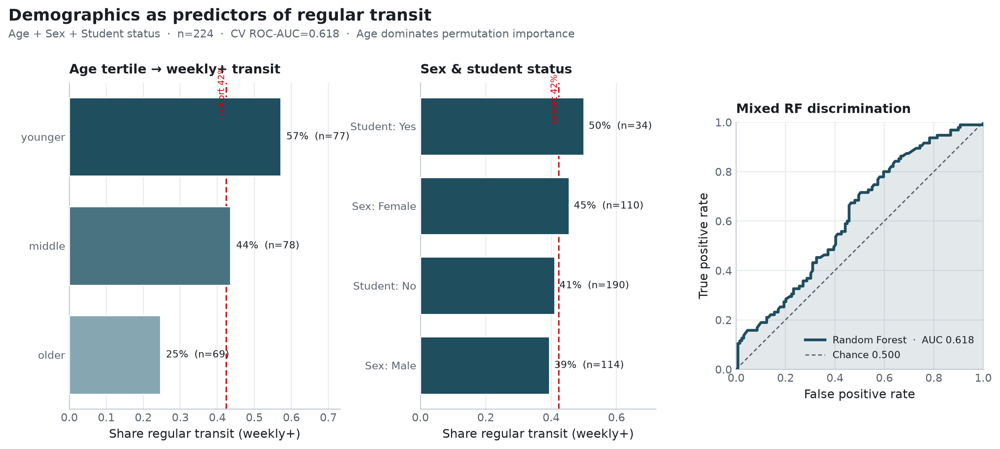

**Research question:** Do Prolific demographics—**Age**, **Sex**, and **Student status**—predict regular public-transit use in the matched cohort?

**Companion:** [`country_predicts_transit.qmd`](country_predicts_transit.qmd) · [`common_n_head_to_head.qmd`](common_n_head_to_head.qmd) · agenda [`docs/research_memo_agenda.md`](../docs/research_memo_agenda.md)

---

## Answer, Response, + Summary of Results

Using the Prolific↔Qualtrics matched analytic definition (weekly+ `Q26`; n = **224** with complete Age/Sex/Student after cleaning `DATA_EXPIRED` student values), we fit a mixed balanced Random Forest (Age numeric; Sex & Student one-hot) with stratified 5-fold CV (`seed=42`).

**Short answer:** Demographics are a **modest but real** predictor (CV ROC-AUC ≈ **0.618**)—above chance (0.50), geo (≈0.55), and the CA benchmark (≈0.59). **Age dominates**; Sex and Student status contribute less.

{#fig-demographics_predict_transit-demographics-followup}

### Prevalence gradients

| Feature | Level | n | % regular |
|---|---|---:|---:|
| Age (tertile) | younger | 77 | **57.1%** |
| Age (tertile) | middle | 78 | 43.6% |
| Age (tertile) | older | 69 | **24.6%** |
| Sex | Female | 110 | 45.5% |
| Sex | Male | 114 | 39.5% |
| Student status | Yes | 34 | 50.0% |
| Student status | No | 190 | 41.1% |

: Feature / Level / n. {#tbl-demographics_predict_transit-1}

### Performance

| Model | n | ROC-AUC | Avg. precision | Balanced acc. | F1 |
|---|---:|---:|---:|---:|---:|
| **Age + Sex + Student** | 224 | **0.618** | 0.544 | 0.567 | 0.515 |
| CA benchmark | 241 | 0.590 | — | — | — |
| Geo benchmark | 241 | 0.551 | — | — | — |
| Chance | — | 0.500 | — | 0.500 | — |

: Model / n / ROC-AUC. {#tbl-demographics_predict_transit-2}

Permutation importance (AUC drop): Age ≈ 0.33 · Sex ≈ 0.13 · Student ≈ 0.06.

### Interpretation

1. The previously unused Prolific demographic block is not null for reverse transit prediction—**younger respondents ride more**.  
2. Student status, flagged as open in the covariate-followups memo, is too sparse (n=34 Yes) to carry much CV signal alone.  
3. For the primary LLM `demos` tier, age-linked error patterns are a plausible stereotyping surface even before employment/transit cues are added.

*Sources:* `ca-personas followup-experiments --experiments demographics` · `src/ca_personas/followup_experiments.py` · `outputs/followup_experiments/demographics/`

---

## What questions or uncertainties remain?

Does age remain predictive after conditioning on Q28 and car access on a common-*N* frame? (Partially answered in [`common_n_head_to_head.qmd`](common_n_head_to_head.qmd)—demographics fall near chance when mobility items are forced into the overlap.)
