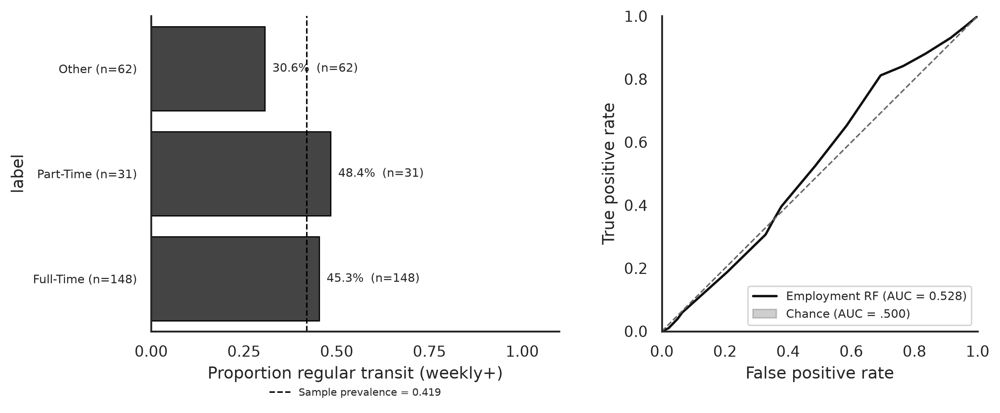

**Research question:** Does employment status predict whether a matched respondent takes public transportation regularly?

**Parent memo:** [`geo_predicts_transit.qmd`](geo_predicts_transit.qmd)  
**Comparison memo:** [`transit_covariate_followups.qmd`](transit_covariate_followups.qmd)

---

## Answer, Response, + Summary of Results

Using the full matched analytic cohort (**n = 241**; 101 regular / 140 not regular), we evaluated **Employment status** (Full-Time / Part-Time / Other) as a single-feature **Random Forest** predicting weekly+ public transit (`Q26` threshold as in the geo and CA memos). Stratified 5-fold CV, `random_state=42`.

**Short answer:** Barely. Employment status yields CV ROC-AUC = **0.528** — only +0.028 above chance and **below** both the geo (**0.551**) and CA (**0.590**) benchmarks. It is not a competitive stand-alone predictor in this sample.

{#fig-et-employment-predicts-transit}

**Descriptive associations.**

| Employment status | n | % regular |
|---|---:|---:|
| Part-Time | 31 | 48.4% |
| Full-Time | 148 | 45.3% |
| Other | 62 | 30.6% |

: Random Forest performance for employment predicting regular transit. {#tbl-et-1}

Part-time and full-time rates are close; the “Other” category is less often regular. With only three coarse levels, discrimination is inherently limited.

**Random Forest (stratified CV).**

| Model | n | ROC-AUC |
|---|---:|---:|
| Employment status RF | 241 | **0.528** |
| Geo RF benchmark | 241 | 0.551 |
| CA RF benchmark | 241 | 0.590 |
| Chance | — | 0.500 |

: Model / n / ROC-AUC. {#tbl-et-2}

Balanced accuracy = 0.560 and Brier = 0.247. Permutation importance mean $\Delta$AUC = 0.059.

**Conclusion.** Employment status, as coded in the Prolific export, recovers AUC = **0.528** for weekly+ transit. It remains useful as a control/covariate in multi-feature models, but it does not outperform geography (0.551) or CA (0.590) on its own.

*Sources:* `notebooks/secondary_rq_employment_transit_rf.ipynb` · `src/ca_personas/transit_covariate_rf.py` · `ca-personas covariate-transit-rf --specs employment` · [github.com/Exios66/psych755-jjb](https://github.com/Exios66/psych755-jjb) · formal write-up [`docs/secondary_rq_transit_covariate_followups.md`](../docs/secondary_rq_transit_covariate_followups.md)

---

## What questions or uncertainties remain?

Would finer employment categories (student, gig work, remote vs on-site) recover more signal? Does employment interact with car access or urbanicity rather than acting as a main effect?

## What other features may also well-predict regular public transit use?

Ride-share (`Q28`/`Q29`) recovers AUC = **0.745** and car access (`Q20`/`Q21`) recovers AUC = **0.607**; see [`rideshare_predicts_transit.qmd`](rideshare_predicts_transit.qmd) and [`car_access_predicts_transit.qmd`](car_access_predicts_transit.qmd).