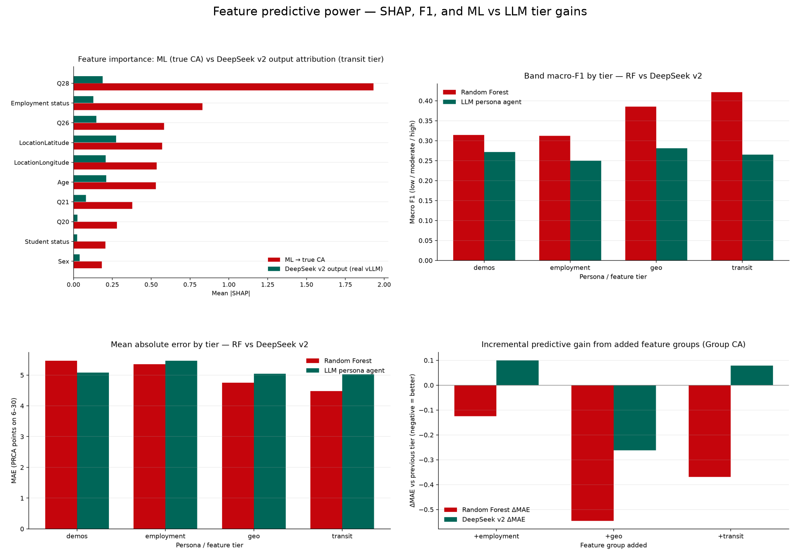
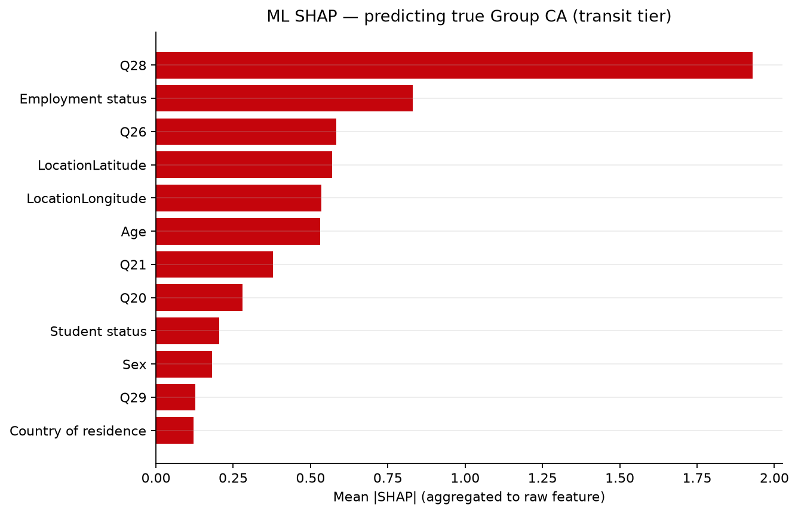
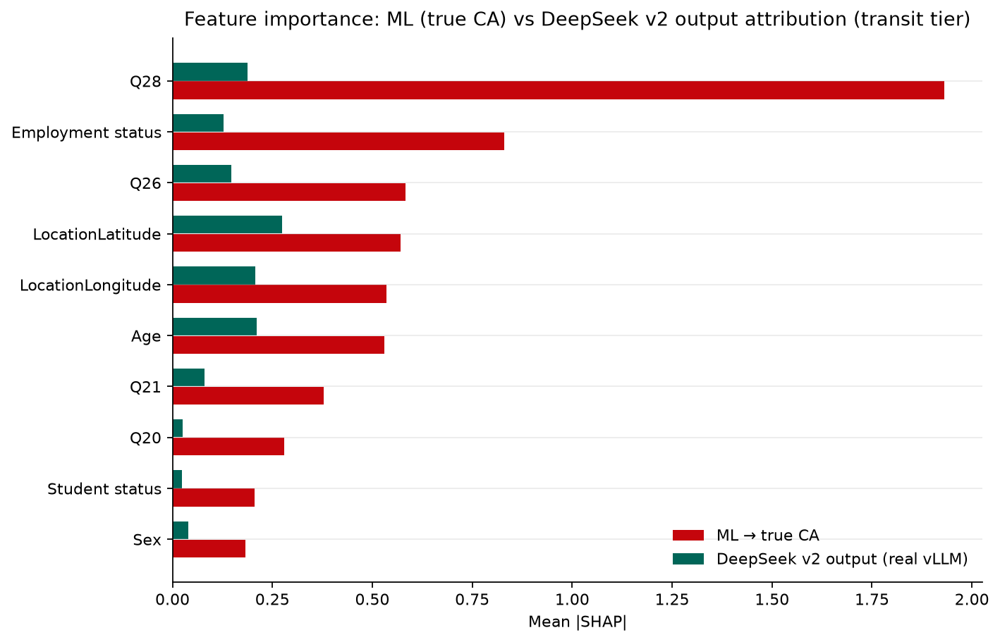
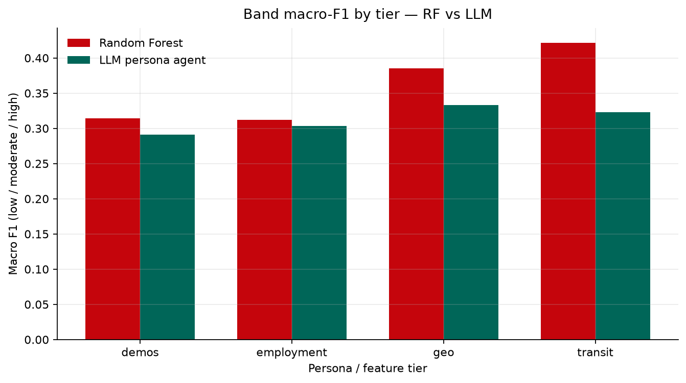
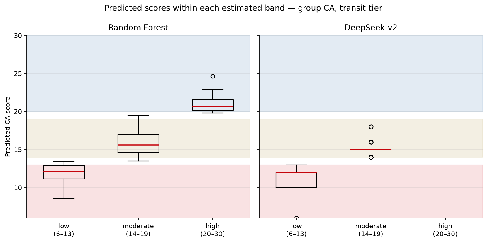
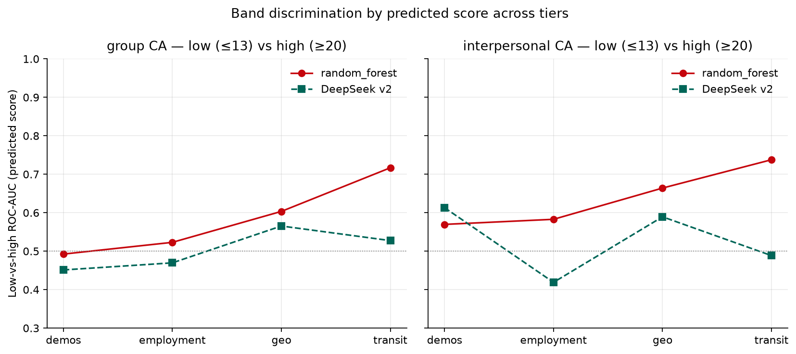
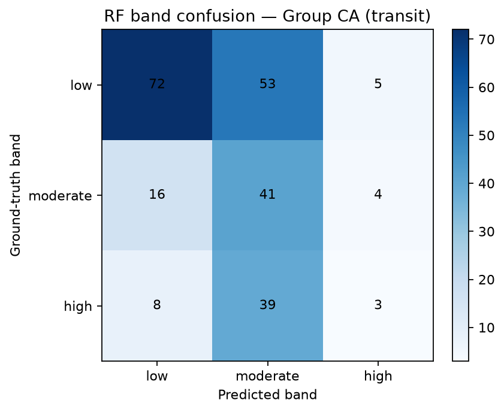
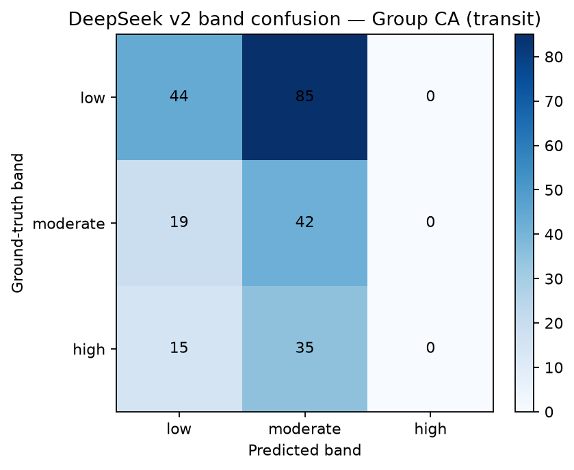

**Research question:** Which demographic and behavioral features have the greatest predictive power for PRCA group and interpersonal communication-apprehension scores under traditional machine-learning models and LLM persona agents — as measured by SHAP attributions, band-level F1, and band discrimination (accuracy, distance, low-vs-high AUC)?

---

## Answer, Response, + Summary of Results

Using the Prolific↔Qualtrics matched analytic cohort (File A + File B stacked joined to File C; **252** matched; analytic **n = 241** with complete scorable PRCA items), we evaluated feature predictive power across the project’s cumulative information tiers (`demos` → `employment` → `geo` → `transit`). Traditional ML used cross-validated **Random Forest** ([@breiman2001]; implemented via scikit-learn [@pedregosa2011]) and **KNN** regressors targeting ground-truth Group and Interpersonal CA (6–30). LLM persona agents ([@argyle2023]) were evaluated on the **same tiers and metrics using the live vLLM exports** — the best non-collapsed model, **DeepSeek-R1-Distill-Llama-8B under prompt-v2 packaging** (`exports/v2/`), replaces the earlier deterministic-mock stand-in. Attribution used **TreeSHAP** on RF models predicting true CA, plus **surrogate SHAP** on an RF fit to live LLM numeric outputs. Classification quality used **macro / weighted / per-band F1**, **band accuracy**, **mean band distance**, and **low-vs-high ROC-AUC** after mapping scores to classroom bands (**low** ≤13, **moderate** 14–19, **high** ≥20).

Full notebook: [`notebooks/feature_predictive_power_shap.ipynb`](../notebooks/feature_predictive_power_shap.ipynb) · module `ca_personas.shap_eval` · real-export harness `scripts/regenerate_ml_vs_llm_shap.py` (the CLI `ca-personas shap-eval --seed 42` keeps a deterministic mock for CI; this memo uses the committed vLLM exports).

**Short answer:** Yes — structured covariates carry measurable predictive power for true CA under Random Forest, with **ride-share frequency (`Q28`)**, **employment status**, **public-transit frequency (`Q26`)**, and **survey geolocation** dominating TreeSHAP importance at the transit tier. Band **macro-F1 rises from ~0.31 (demos) to ~0.42 (transit)** for RF as information accumulates. The live LLM surrogate confirms the persona agent tracks profile features (surrogate $R^2 \approx 0.74$ for Group CA), but the attribution profile is **shifted**: DeepSeek v2 over-weights **geolocation and Age** relative to the `Q28`/employment mix that predicts true CA, its **low-vs-high band AUC is ≈ chance** (0.53 group / 0.49 interpersonal at transit vs RF 0.72 / 0.74), it **never emits the high-CA band** (≥20), and it stays above the RF MAE floor at every tier (transit mean MAE **5.03** vs **4.48**).

Figure @fig-fp-fig-feature-power-composite summarizes the composite SHAP, F1/MAE-by-tier, and tier-ablation comparison.

{#fig-fp-fig-feature-power-composite}

### Traditional ML — predictive power by tier

Mean metrics across Group + Interpersonal targets (`random_state=42`, stratified/K-fold CV).
**Note:** the RF MAE column is the **mean of group and interpersonal MAE** from the
classic RF+k-NN SHAP suite — not the group-only transit RF MAE (**4.68**) reported in
[`docs/ml_baselines.md`](../docs/ml_baselines.md).

Table @tbl-fp-1 reports the RF and KNN MAE and band-F1 metrics by tier.

| Tier | RF MAE ↓ (mean of both targets) | RF macro-F1 ↑ | RF band acc | KNN MAE | KNN macro-F1 |
|---|---|---:|---:|---:|---:|
| demos | 5.47 | 0.314 | 0.367 | 5.54 | 0.309 |
| employment | 5.35 | 0.312 | 0.369 | 5.54 | 0.334 |
| geo | 4.75 | 0.386 | 0.452 | 5.37 | 0.345 |
| **transit** | **4.48** | **0.422** | **0.506** | 4.98 | 0.372 |

: Feature predictive power for ML and LLM. {#tbl-fp-1}

At the transit tier, Group CA RF band F1 components were low=0.64 · moderate=0.42 · high=0.10 (macro=0.39); Interpersonal CA was stronger on high-band F1 (low=0.64 · moderate=0.48 · high=0.25; macro=0.46). Exact integer accuracy stayed low (~0.07), confirming that **band-level metrics**, not exact match, are the appropriate classification summary on a 6–30 scale.

**Tier ablation (Group CA, RF).** Adding geo cut MAE by **−0.55** points vs employment; adding transit cut another **−0.37**, with corresponding macro-F1 gains (+0.05 then +0.03). Employment alone produced only a small MAE improvement over demos.

### SHAP — features driving ML predictions of true CA

TreeSHAP mean $\|SHAP\|$ (aggregated to raw fields) for RF → true **Group CA** at the transit tier (see Table @tbl-fp-2).
This ranking (predicting **CA**) is not interchangeable with the permutation ranking in
[`docs/factor_feature_importance.md`](../docs/factor_feature_importance.md) (predicting
**regular transit**), where Age outranks employment.

| Rank | Feature | Mean $\|SHAP\|$ |
|---|---|---:|
| 1 | `Q28` (ride-share days) | 1.93 |
| 2 | Employment status | 0.83 |
| 3 | `Q26` (public-transit days) | 0.58 |
| 4 | LocationLatitude | 0.57 |
| 5 | LocationLongitude | 0.54 |
| 6 | Age | 0.53 |

: Rank / Feature / Mean $\|SHAP\|$ for RF → true Group CA at the transit tier. {#tbl-fp-2}

{#fig-fp-fig-shap-bar-ml-group}

As shown in Figure @fig-fp-fig-shap-bar-ml-group, transportation items and employment dominate over core demographics (Sex, Student status), supporting the primary research focus: **RQ1–RQ2 covariates are not decorative — they reshape predicted apprehension under classical ML.**

### Live LLM persona agents — performance and surrogate SHAP

All LLM figures below use the **committed vLLM exports** (full cohort, N = 241 per tier), not the mock provider. The headline agent is **DeepSeek v2** — the best non-collapsed live model (pooled group MAE **5.02**, transit IP MAE **5.09**); Llama-3.1's interpersonal collapse at `transit` and Llama-3.2's non-monotonic profile are reported in the manuscript and [`docs/llm_v2_v3_enhanced_variants.md`](../docs/llm_v2_v3_enhanced_variants.md).

Table @tbl-fp-3 reports the tier-by-tier RF vs DeepSeek v2 MAE and band metrics.

| Tier | RF MAE ↓ | DeepSeek v2 MAE ↓ | RF macro-F1 ↑ | DeepSeek v2 macro-F1 | RF band acc | DeepSeek v2 band acc |
|---|---|---:|---:|---:|---:|---:|
| demos | 5.47 | **5.08** | **0.314** | 0.272 | **0.367** | 0.342 |
| employment | **5.35** | 5.47 | **0.312** | 0.250 | **0.369** | 0.342 |
| geo | **4.75** | 5.05 | **0.386** | 0.281 | **0.452** | 0.349 |
| **transit** | **4.48** | 5.03 | **0.422** | 0.265 | **0.506** | 0.360 |

: Tier / RF MAE ↓ / DeepSeek v2 MAE ↓. {#tbl-fp-3}

Mean of group + interpersonal targets. DeepSeek v2 trails RF on **every** tier and metric. Its tier profile is also flatter — employment and transit add nothing (and slightly worsen) LLM error, whereas RF improves monotonically with information.

Surrogate SHAP (RF predicting live LLM Group CA from tabular features; $R^2 = 0.74$) ranked **lat/long, Age, `Q28`, country, `Q26`, employment** highest — i.e., the persona agent’s outputs track place and age more than the `Q28`/employment mix that predicts true CA. Magnitudes are also compressed (0.13–0.27 vs ML’s 0.53–1.93), so no single profile feature dominates the agent’s scores (Table @tbl-fp-4):

| Rank | DeepSeek v2 surrogate $\|SHAP\|$ | RF $\|SHAP\|$ (true CA) |
|---|---:|---:|
| 1 | LocationLatitude 0.27 | `Q28` 1.93 |
| 2 | Age 0.21 | Employment status 0.83 |
| 3 | LocationLongitude 0.21 | `Q26` 0.58 |
| 4 | `Q28` 0.19 | LocationLatitude 0.57 |
| 5 | Country of residence 0.15 | LocationLongitude 0.54 |
| 6 | `Q26` 0.15 | Age 0.53 |
| 7 | Employment status 0.13 | `Q21` 0.38 |

: Rank / DeepSeek v2 surrogate $\|SHAP\|$ vs RF $\|SHAP\|$ (true Group CA) at the transit tier. {#tbl-fp-4}

Figure @fig-fp-fig-shap-ml-vs-llm-compare juxtaposes the ML TreeSHAP and DeepSeek v2 surrogate SHAP bars.

{#fig-fp-fig-shap-ml-vs-llm-compare}

Figure @fig-fp-fig-f1-ml-vs-llm plots band macro-F1 by tier for RF vs DeepSeek v2.

{#fig-fp-fig-f1-ml-vs-llm}

### What the estimated bands actually contain

When a model says “**low**”, “**moderate**”, or “**high**”, which numeric scores did it output, and how do they relate to ground truth? Group CA, `transit` tier (Table @tbl-fp-5):

| Agent | Predicted band | n | Pred score M (range) | GT score M | MAE | Band precision |
|---|---:|---:|---:|---:|---:|---:|
| RF | low (6–13) | 96 | 11.95 (8.56–13.48) | 12.10 | 3.49 | 0.75 |
| RF | moderate (14–19) | 133 | 15.92 (13.50–19.47) | 16.30 | 5.31 | 0.31 |
| RF | high (20–30) | 12 | 21.12 (19.82–24.64) | 16.17 | 7.17 | 0.25 |
| DeepSeek v2 | low (6–13) | 78 | 11.18 (6–13) | 13.76 | 5.45 | 0.56 |
| DeepSeek v2 | moderate (14–19) | 162 | 15.01 (14–18) | 15.06 | 4.73 | 0.26 |
| DeepSeek v2 | high (20–30) | **0** | — | — | — | — |

: Agent / Predicted band / sample-size. {#tbl-fp-5}

Figure @fig-fp-fig-band-score-profiles shows the predicted-score profiles inside each estimated band.

{#fig-fp-fig-band-score-profiles}

:::{.callout-important}

Two quantification findings stand out. **First, the LLM never emits the high band for Group CA at `transit`** (0 of 240 predictions ≥ 20; n = 3 at `geo`, all exactly 20.0) — its “moderate” label covers the full 14–18 span and absorbs every high-apprehension respondent. **Second, RF’s rare high-band predictions (n = 12) are badly calibrated**: they land on respondents whose true mean is 16.17 (moderate), so RF precision on high is only 0.25. Both families are strong only on the low band; band precision collapses to 0.26–0.31 on moderate/high.

:::

### Band discrimination (accuracy, distance, low-vs-high AUC)

Disentangling MAE from discrimination: the LLM is only ~1.1× worse on MAE, but on band separation it is much worse — its continuous scores are effectively **uninformative about low vs high apprehension** (Table @tbl-fp-6).

| Tier | Agent | Side | Band acc | F1 macro | Mean band dist | AUC low-vs-high | Ordinal AUC |
|---|---|---:|---:|---:|---:|---:|---:|
| transit | RF | Group | 0.481 | 0.386 | 0.573 | **0.717** | **0.650** |
| transit | RF | Interpersonal | 0.531 | 0.458 | 0.515 | **0.738** | **0.664** |
| transit | DeepSeek v2 | Group | 0.358 | 0.267 | 0.704 | 0.527 | 0.518 |
| transit | DeepSeek v2 | Interpersonal | 0.362 | 0.263 | 0.683 | 0.488 | 0.491 |

: Tier / Agent / Side. {#tbl-fp-6}

*Notes.* AUC low-vs-high = predicted score separating ground-truth high (≥20) from low (≤13) respondents (moderates excluded); ordinal AUC = Hand–Till pairwise AUC over all three bands (0.5 = chance). Full per-tier/per-band table: `outputs/shap_eval/band_discrimination_ml_llm.csv`.

Figure @fig-fp-fig-band-discrimination-auc plots the low-vs-high ROC-AUC across tiers.

{#fig-fp-fig-band-discrimination-auc}

Figures @fig-fp-fig-confusion-rf-group and @fig-fp-fig-confusion-llm-group show the RF and DeepSeek v2 band confusion matrices.

{#fig-fp-fig-confusion-rf-group}

{#fig-fp-fig-confusion-llm-group}

:::{.callout-important}

The discrimination gap widens as tiers accumulate: RF's low-vs-high AUC climbs from ~0.49 (demos) to **0.72–0.74** (transit), while DeepSeek v2 stays at 0.49–0.53 across tiers (near chance). This is the mechanism behind the small MAE gap: the LLM is consistently near the cohort mean, so its absolute error is bounded, but its scores do not rank apprehension. Mean band distance tells the same story (RF 0.51–0.57 ≈ half a band off; DeepSeek v2 0.68–0.70). **MAE alone therefore understates the LLM's failure to recover the trait distribution.**

:::

**Conclusion.** Feature predictive power for communication apprehension in this matched cohort is **real but moderate**: richer tiers improve RF MAE, band F1, and low-vs-high discrimination, and TreeSHAP attributes that lift primarily to **transit use, employment, and geolocation**. The live LLM (DeepSeek v2) remains above the RF floor on every score and band metric, over-weights place/age in its surrogate attributions, avoids the high-CA band entirely, and shows near-chance band discrimination. LLM persona evaluation should therefore report **band F1, band accuracy, band distance, and low-vs-high AUC alongside MAE**, and use **surrogate SHAP (or tier ablation)** to audit whether the agent tracks the same covariates that predict true CA — or instead over-weights demographic/geographic stereotypes.

*Sources:* `notebooks/feature_predictive_power_shap.ipynb` · `src/ca_personas/shap_eval.py` · `ca-personas shap-eval` (mock for CI) · **`scripts/regenerate_ml_vs_llm_shap.py` (real vLLM exports)** · artifacts `outputs/shap_eval/` (synced to `artifacts/posit_full_cohort/ml_vs_llm/` for manuscript renders) · `exports/v2/` · [github.com/Exios66/psych755-jjb](https://github.com/Exios66/psych755-jjb)

---

## What questions or uncertainties remain?

Does the canonical `v3_enhanced` decode (temp 0.3, guided JSON) change DeepSeek's near-chance band discrimination, or is high-band avoidance intrinsic to the reasoning-distilled family? Would interaction SHAP (employment × transit) explain the residual over-weighting of place/age? Are band rankings stable under alternate cutoffs (e.g., ≤12 / ≥21)? Do the smaller Llama-3.2–3B and collapsed Llama-3.1/3.3–70B exports show the same discrimination floor or worse?

## What other analyses pair with this memo?

Secondary RQs on transit↔CA mean differences and CA/geo → regular-transit Random Forests ([`transit_riders_ca.qmd`](transit_riders_ca.qmd), [`geo_predicts_transit.qmd`](geo_predicts_transit.qmd)) ask the reverse predictive direction. The present memo asks which **inputs** best recover CA under ML and LLM personification, and which **bands** the models actually separate. Live-model stereotyping slices on the same v2 export ([`live_llm_stereotyping_slices.qmd`](live_llm_stereotyping_slices.qmd)) and the cross-model / v2-v3 ranking memos ([`vllm_v1_cross_model_comparison.qmd`](vllm_v1_cross_model_comparison.qmd), [`vllm_v2_v3_evaluation.qmd`](vllm_v2_v3_evaluation.qmd)) complete the LLM-side picture.
