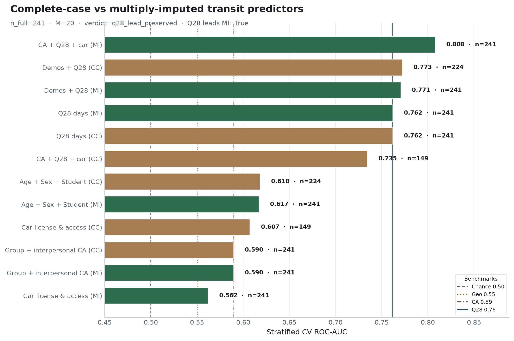

**Research question:** Would a multiply-imputed analysis restore demographics/CA while preserving the Q28 lead, or would imputation attenuate rideshare’s advantage?

**Parent:** [`common_n_head_to_head.md`](common_n_head_to_head.md) · **Companions:** [`q28_conditioned_on_car.md`](q28_conditioned_on_car.md) · [`demographics_predict_transit.md`](demographics_predict_transit.md) · [`ca_scores_predict_transit.md`](ca_scores_predict_transit.md)

---

## Answer, Response, + Summary of Results

We compare each predictor family under **listwise complete-case** versus **M = 20** multivariate imputations of the missing-prone items (**Q20**, **Q21**, **Student status**), using chained equations (`IterativeImputer`, `sample_posterior=True`) with complete auxiliaries (Age, Sex, CA, Q28, employment, country, lat/long). Outcome-labeled base n = **241** (seed 42, stratified CV). Q28 and CA are never imputed—they appear in both arms as observed.

**Short answer:** **Q28’s singleton lead is preserved** under MI (AUC ≈ **0.762**). Demographics and CA are **not restored** to competitive levels (≈ 0.617 and 0.590); imputation does **not** attenuate rideshare’s advantage among single-family models. Joint models that *include* Q28 remain strongest (CA+Q28+car MI ≈ **0.808**).

### Complete-case vs multiply-imputed ranking (n_full = 241)

| Feature family | CC *n* | CC AUC | MI *n* | MI AUC | Δ (MI − CC) |
|---|---:|---:|---:|---:|---:|
| CA + Q28 + car (joint) | 149 | 0.736 | 241 | **0.808** | +0.072 |
| Demos + Q28 (joint) | 224 | 0.773 | 241 | 0.771 | −0.002 |
| **Q28 days** | 241 | **0.762** | 241 | **0.762** | 0.000 |
| Age + Sex + Student | 224 | 0.618 | 241 | 0.617 | −0.001 |
| Group + interpersonal CA | 241 | 0.590 | 241 | 0.590 | 0.000 |
| Car license & access | 149 | 0.607 | 241 | 0.562 | −0.045 |

**Singleton MI order:** Q28 ≫ demographics ≫ CA ≳ car.

### Interpretation

1. **Rideshare advantage is not an artifact of complete-case *N*.** On the full analytic frame with MI-filled car/student items, Q28 still outranks demographics, CA, and car as a *singleton* family—the same ordinal conclusion as the common-*N* memo.  
2. **MI does not “restore” demos/CA.** Expanding Student-missing rows to n = 241 leaves demographics ≈ 0.617 (flat vs their own CC). CA is unchanged because it was already complete. Neither approaches Q28.  
3. **Imputation mainly helps *joint* mobility models.** Filling Q20/Q21 lets CA+Q28+car train on all 241 rows and lifts AUC (0.736 → 0.808). Standalone car *weakens* under MI (0.607 → 0.562)—imputed car is a noisier cue than car observed on the selected complete-case subset.  
4. Joint demos+Q28 stays high (~0.77) but still tracks Q28 rather than a demography rebound.

*Sources:* `ca-personas followup-experiments --experiments mi_head_to_head --n-imputations 20` · `outputs/followup_experiments/mi_head_to_head/` · Posit full-cohort artifacts (n = 241)

---

## What questions or uncertainties remain?

Would a richer imputation model (e.g. including interaction terms, or imputing under a MAR vs MNAR sensitivity design) change the car attenuation pattern? Would ordinal / multilevel MI of Q28 strata alter residual-CA contrasts within ride-share days?
