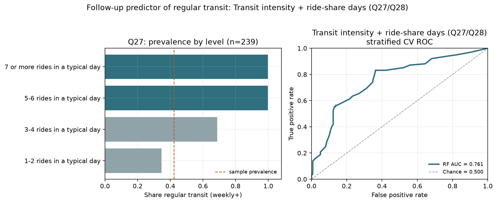
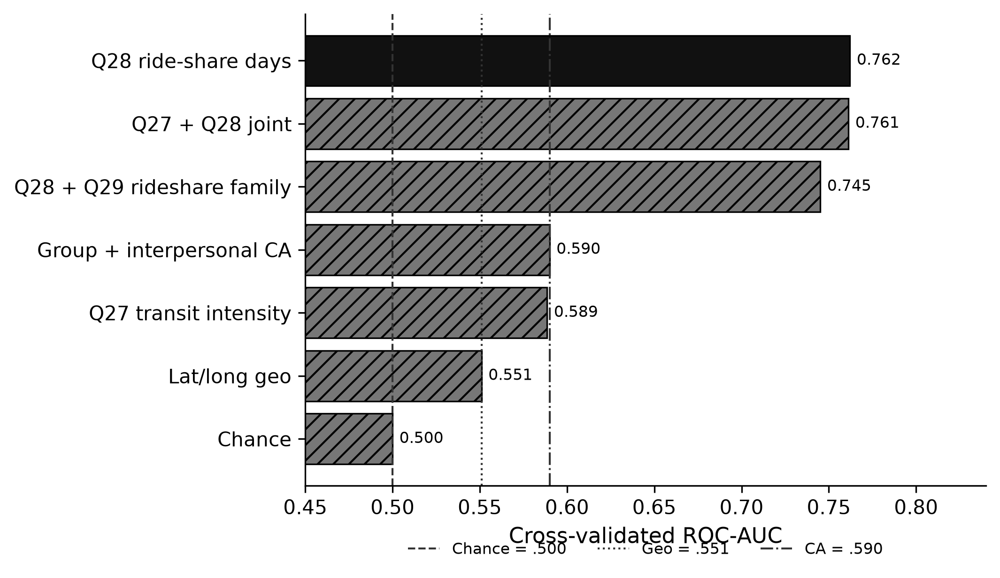

**Research question:** In traditional machine-learning classifiers, how much predictive power do survey items **Q27** (rides on a typical public-transit day) and **Q28** (ride-share days in the last three months) carry for **regular** public-transit use?

**Companion memos:** [`rideshare_predicts_transit.md`](rideshare_predicts_transit.qmd) · [`transit_covariate_followups.md`](transit_covariate_followups.qmd) · parent [`geo_predicts_transit.md`](geo_predicts_transit.qmd)  
**Manuscript:** [`index.qmd`](../index.qmd) § *Secondary results: Q27/Q28 as ML predictors of regular transit*

---

## Answer, Response, + Summary of Results

Using the Prolific↔Qualtrics matched analytic cohort (File A + File B joined to File C; base **n = 241** with complete PRCA and usable `Q26`), we define **regular transit** as `Q26` ∈ {`4-8 days a month`, `8 or more days a month`} (weekly-or-more). We then fit balanced **Random Forests** with stratified 5-fold CV (`random_state=42`) using categorical one-hot encodings of:

| Item | Stem (abridged) | Role |
|---|---|---|
| **Q27** | On a typical day of public transportation use, how many rides do you take? | Within-mode **intensity** |
| **Q28** | In the last three months on how many days did you use ride-share platforms? | Cross-mode **ride-share exposure** |

: Q27 and Q28 survey items. {#tbl-q27q28-1}

**Short answer:** **Q28** recovers CV ROC-AUC = **0.762** (AP = 0.689; balanced accuracy = 0.730). **Q27** recovers AUC = **0.589**—matching the CA benchmark (0.590)—and the joint Q27+Q28 forest reaches AUC = **0.761** (Δ = −0.001 vs Q28 alone). Ride-share days, not transit-day intensity, carry the usable discrimination.

{#fig-q27q28-q27-q28-predicts-transit}

{#fig-q27q28-q27-q28-predicts-transit-comparison}

### Descriptive gradients

**Q27 (n = 239).** Respondents reporting more rides on a typical transit day are more often weekly+ riders, but most of the sample sits in the lowest intensity bin:

| Q27 | n | % regular |
|---|---:|---:|
| 1–2 rides / typical day | 190 | 34.7% |
| 3–4 rides / typical day | 45 | 68.9% |
| 5–6 rides / typical day | 3 | 100% |
| 7+ rides / typical day | 1 | 100% |

: Q27 intensity distribution by regular transit status. {#tbl-q27q28-2}

**Q28 (n = 241).** Regular-transit prevalence rises steeply with ride-share days:

| Q28 | n | % regular |
|---|---:|---:|
| Never | 70 | 15.7% |
| 0–1 days a month | 47 | 23.4% |
| 2–4 days a month | 65 | 52.3% |
| 4–8 days a month | 42 | 69.0% |
| 8 or more days a month | 17 | **94.1%** |

: Q28 ride-share days by regular transit status. {#tbl-q27q28-3}

### Random Forest performance (stratified CV)

| Model | n | ROC-AUC | Avg. precision | Balanced acc. | F1 |
|---|---:|---:|---:|---:|---:|
| **Q28 only** | 241 | **0.762** | 0.689 | 0.730 | 0.702 |
| **Q27 + Q28** | 239 | **0.761** | 0.690 | 0.696 | 0.667 |
| Q28 + Q29 (rideshare family) | 233 | 0.745 | 0.655 | 0.731 | 0.709 |
| **Q27 only** | 239 | **0.589** | 0.513 | 0.623 | 0.467 |
| CA RF benchmark | 241 | 0.590 | — | — | — |
| Geo RF benchmark | 241 | 0.551 | — | — | — |
| Chance | — | 0.500 | — | 0.500 | — |

: Random Forest performance for Q27 and Q28 predicting regular transit. {#tbl-q27q28-4}

Permutation importance in the joint **Q27 + Q28** forest ranks **Q28** (mean AUC drop = 0.240) far above **Q27** (0.041). Adding Q29 (rides on a typical ride-share day) to Q28 does not improve AUC over Q28 alone (rideshare family AUC = 0.745).

### Interpretation

1. **Significance for traditional ML.** Among mobility self-reports tested as reverse predictors of weekly+ transit, **Q28 is the dominant signal**—exceeding survey geolocation by +0.211 AUC (0.762 vs 0.551) and group/interpersonal CA by +0.172 (0.762 vs 0.590). A single categorical ride-share-days item recovers AP = 0.689 and balanced accuracy = 0.730.
2. **Q27’s limited role.** Intensity-on-use-days is associated with regular ridership but is sparse above 1–2 rides (n = 3 and n = 1 in the top bins) and yields AUC = 0.589. It is also *conceptually adjacent* to the `Q26` outcome (both describe public-transit behavior), so that AUC should not be over-interpreted as an independent lifestyle cue.
3. **Joint model.** Q27 does not meaningfully lift Q28; the joint forest is essentially a ride-share-days classifier. For persona-tier design, this reinforces treating **ride-share exposure** as the high-value transit cue in tabular learners ([`docs/factor_feature_importance.md`](../docs/factor_feature_importance.md) likewise ranks Q28 first when predicting CA).
4. **Non-causal caveat.** Same-wave self-reports cannot separate multimodality, urbanicity, income, or common method variance between `Q26` and `Q28`.

*Sources:* `ca-personas covariate-transit-rf --specs q27_intensity q28_days q27_q28` · `src/ca_personas/transit_covariate_rf.py` · artifacts `outputs/transit_covariate_rf/{q27_intensity,q28_days,q27_q28}/` · [github.com/Exios66/psych755-jjb](https://github.com/Exios66/psych755-jjb)

---

## What questions or uncertainties remain?

Would Q28 retain its lift after conditioning on city density or car access? Does Q27 help *within* the regular-rider subgroup for intensity forecasting even though it weakly predicts the weekly+ threshold?
