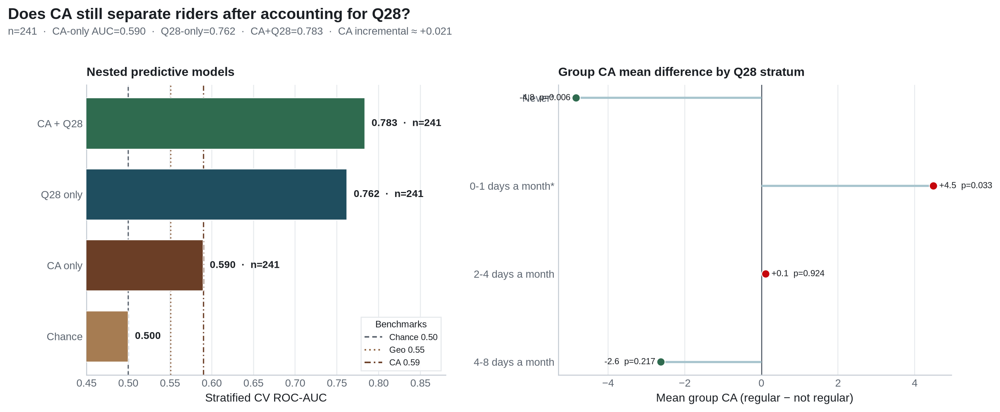

**Research question:** After accounting for ride-share days (**Q28**), does group/interpersonal CA still separate regular from non-regular public-transit riders?

**Parent open questions:** [`transit_riders_ca.md`](transit_riders_ca.md) · [`ca_scores_predict_transit.md`](ca_scores_predict_transit.md)

---

## Answer, Response, + Summary of Results

On Q28-complete rows (n = **241**), we (i) replicate the overall transit→CA Welch contrast, (ii) compare nested RFs (CA only / Q28 only / CA+Q28), and (iii) run within-Q28-stratum Welch tests.

**Short answer:** The **mean CA gap among regular riders remains real overall**, but for *prediction* CA adds almost nothing once Q28 is present (**+0.021** AUC). Within Q28 strata, CA differences are **heterogeneous**—sometimes reversed.

### Overall transit → CA (replication)

| Score | Mean regular | Mean not | Δ | Cohen’s *d* | Welch *p* |
|---|---:|---:|---:|---:|---:|
| Group CA | 13.04 | 15.76 | −2.72 | −0.46 | <.001 |
| Interpersonal CA | 13.31 | 15.04 | −1.73 | −0.30 | .020 |

### Nested predictive models

| Model | ROC-AUC |
|---|---:|
| **CA + Q28** | **0.783** |
| Q28 only | 0.762 |
| CA only | 0.590 |
| Chance | 0.500 |

CA incremental over Q28 ≈ **+0.021**.

### Within-Q28 strata (exploratory)

| Q28 level | Group CA Δ (reg − not) | Welch *p* | Note |
|---|---:|---:|---|
| Never | **−4.83** | .006 | Regulars lower CA |
| 0–1 days/month | **+4.49** | .033 | Regulars *higher* CA |
| 2–4 days/month | +0.11 | .92 | Null |
| 4–8 days/month | −2.62 | .22 | Underpowered |
| 8+ days/month | — | — | Nearly all regular |

### Interpretation

1. Third-variable concern from the transit→CA memo is partly justified for **prediction**: Q28 absorbs most ranking signal.  
2. The descriptive CA gap is not a pure Q28 artifact—contrasts persist in the Never stratum—but the **0–1 days reversal** warns against a single global CA–transit story.  
3. For persona-tier design, ride-share exposure remains the higher-value mobility cue; CA should not be treated as an independent transit classifier once Q28 is known.

*Sources:* `ca-personas followup-experiments --experiments residual_ca_q28` · `outputs/followup_experiments/residual_ca_q28/`

---

## What questions or uncertainties remain?

Are stratum reversals stable under alternate Q28 groupings or a formal interaction model (CA × Q28)? Larger samples would be needed for confirmatory stratum-wise inference.
