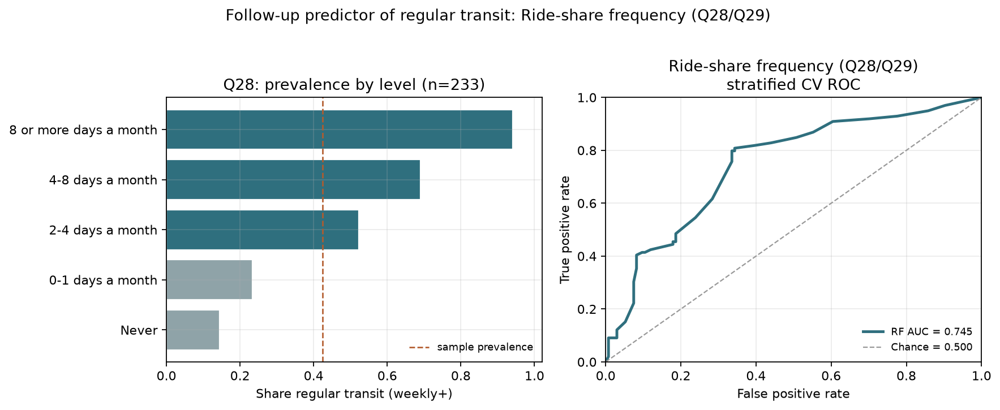

**Research question:** Does ride-share use (`Q28` days; `Q29` typical rides) predict whether a matched respondent takes public transportation regularly?

**Parent memo:** [`geo_predicts_transit.md`](geo_predicts_transit.md)  
**Comparison memo:** [`transit_covariate_followups.md`](transit_covariate_followups.md)

---

## Answer, Response, + Summary of Results

Using the matched analytic cohort with complete `Q28`/`Q29` (**n = 233**; 99 regular / 134 not regular; prevalence ≈ 42.5%), we fit a balanced Random Forest (stratified 5-fold CV, `seed=42`) predicting weekly+ transit from ride-share **days in the last three months** (`Q28`) and **rides on a typical ride-share day** (`Q29`).

**Short answer:** Yes — clearly, and much more strongly than geography or CA. Ride-share frequency recovers CV ROC-AUC ≈ **0.745**, well above chance (0.500), geo (≈ **0.551**), and CA (≈ **0.590**). Signal is driven almost entirely by **`Q28`**.

**Descriptive associations (`Q28`).** Regular transit rises monotonically with ride-share days:

| Q28 (ride-share days) | n | % regular |
|---|---:|---:|
| Never | 62 | 14.5% |
| 0–1 days a month | 47 | 23.4% |
| 2–4 days a month | 65 | 52.3% |
| 4–8 days a month | 42 | 69.0% |
| 8 or more days a month | 17 | **94.1%** |

`Q29` (rides per typical day) shows a milder gradient and is sparsely populated above 1–2 rides.

**Random Forest (stratified CV).**

| Model | n | ROC-AUC | Balanced acc. | F1 |
|---|---:|---:|---:|---:|
| Q28 + Q29 RF | 233 | **0.745** | 0.731 | 0.709 |
| CA RF benchmark | 241 | 0.590 | — | — |
| Geo RF benchmark | 241 | 0.551 | — | — |
| Chance | — | 0.500 | 0.500 | — |

Permutation importance: **Q28** mean AUC drop ≈ 0.29 vs much smaller contribution from **Q29**. Average precision ≈ 0.655 and Brier ≈ 0.197 indicate useful ranking and calibration relative to the weaker geo/CA forests.

**Conclusion.** Among the geo-memo follow-up candidates, ride-share frequency is the **strongest** stand-alone predictor of regular public-transit use. The association is theoretically expected (shared mobility habits / multimodal travelers) but is still same-wave and non-causal; `Q28` and `Q26` may also share response styles or urban lifestyle confounds.

*Sources:* `notebooks/secondary_rq_rideshare_transit_rf.ipynb` · `src/ca_personas/transit_covariate_rf.py` · `ca-personas covariate-transit-rf --specs rideshare` · [github.com/Exios66/psych755-jjb](https://github.com/Exios66/psych755-jjb)

---

## What questions or uncertainties remain?

How much of the `Q28`→`Q26` link is multimodality versus correlated urbanicity/income? Would excluding same-domain mobility items change persona-tier evaluation differently from this reverse-prediction task?

## What other features may also well-predict regular public transit use?

Car access adds incremental descriptive signal (AUC ≈ 0.607) but the joint car+employment+ride-share bundle (AUC ≈ 0.747) barely exceeds ride-share alone on the smaller complete-case subset—see the comparison memo.
