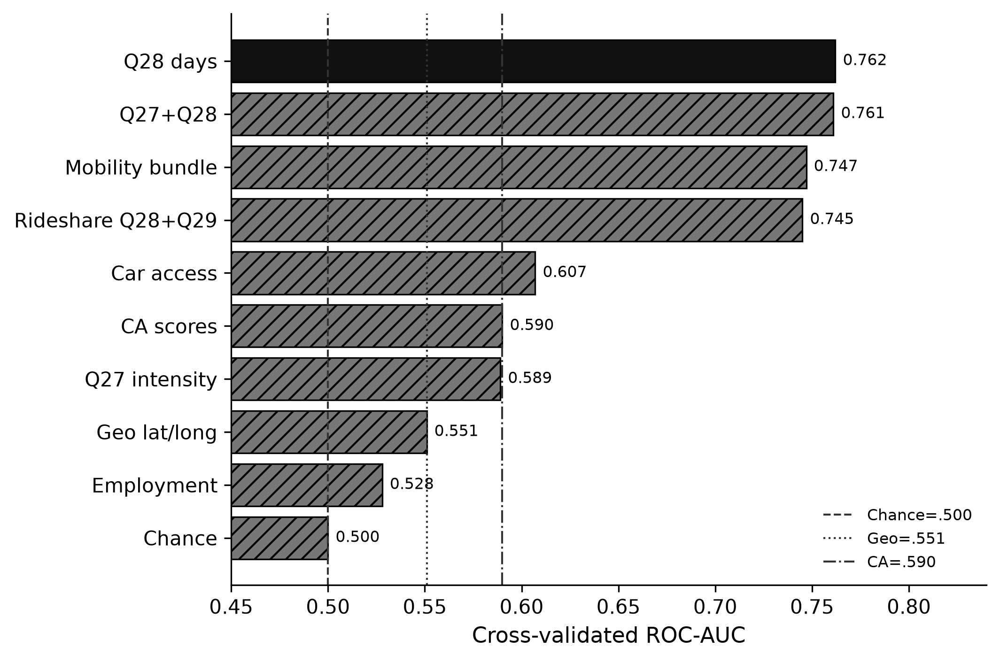

**Research question:** Among the candidates listed in the geography → transit memo—car license/access (`Q20`/`Q21`), employment status, and ride-share frequency (`Q28`/`Q29`)—which features best predict regular public-transit use?

**Parent memo:** [`geo_predicts_transit.md`](geo_predicts_transit.md)  
**Family memos:** [`car_access_predicts_transit.md`](car_access_predicts_transit.md) · [`employment_predicts_transit.md`](employment_predicts_transit.md) · [`rideshare_predicts_transit.md`](rideshare_predicts_transit.md) · [`q27_q28_predict_transit.md`](q27_q28_predict_transit.md) (Q27 vs Q28 traditional ML)

---

## Answer, Response, + Summary of Results

We re-used the Prolific↔Qualtrics matched analytic definition (weekly+ `Q26` outcome; companion geo AUC ≈ **0.551**, CA AUC = **0.590**, chance = **0.500**) and ran balanced Random Forests with stratified 5-fold CV (`seed=42`) for each feature family, plus a joint **mobility bundle**. Complete-case *N* differs by family because `Q20`/`Q21` (and some `Q29`) are missing more often than employment or `Q28`.

**Short answer:** **Ride-share frequency is the clear winner** (AUC = **0.745**). Car access is a useful mid-tier predictor (= **0.607**). Employment alone is weak (= **0.528**). Bundling all mobility items (= **0.747**) does not meaningfully beat ride-share alone once *N* shrinks to respondents with complete car items.

### Head-to-head CV performance

| Feature family | Analytic n | Regular | ROC-AUC | vs geo | vs CA |
|---|---:|---:|---:|:---:|:---:|
| Mobility bundle (Q20/Q21 + Q28/Q29 + employment) | 143 | 56 | **0.747** | ✓ | ✓ |
| Ride-share (Q28/Q29) | 233 | 99 | **0.745** | ✓ | ✓ |
| Car license & access (Q20/Q21) | 149 | 58 | **0.607** | ✓ | ✓ |
| Group + interpersonal CA *(benchmark)* | 241 | 101 | 0.590 | ✓ | — |
| Lat/long *(benchmark)* | 241 | 101 | 0.551 | — | — |
| Employment status | 241 | 101 | **0.528** | ✗ | ✗ |
| Chance / prevalence | — | — | 0.500 | — | — |

### What drives the ranking

1. **`Q28` ride-share days** shows a steep prevalence gradient (Never = 15.7% regular → 8+ days/month = 94.1% regular) and dominates permutation importance in both the rideshare-only and bundle models.
2. **`Q21` car access** separates groups sharply among complete cases (No access ≈ 76% regular vs Yes ≈ 31%), lifting car-only AUC above CA/geo despite smaller *N*.
3. **Employment** (Full-Time / Part-Time / Other) barely moves the ROC curve; treat it as a control, not a primary classifier.
4. The **bundle**’s near-tie with ride-share alone indicates limited incremental value from car/employment once ride-share is in the model—on the overlapping complete-case subset.

**Conclusion.** For predicting weekly+ public transit in this cohort, the geo memo’s ride-share candidates are substantially more informative than survey geolocation or CA scores; car access is a secondary mobility cue; employment status alone is not competitive. Same-wave self-reports still preclude causal claims, and AUCs should not be compared naively across unequal complete-case samples without that caveat.

*Sources:* `notebooks/secondary_rq_transit_covariate_followups.ipynb` · `src/ca_personas/transit_covariate_rf.py` · `ca-personas covariate-transit-rf` · artifacts `outputs/transit_covariate_rf/` · [github.com/Exios66/psych755-jjb](https://github.com/Exios66/psych755-jjb)

---

## What questions or uncertainties remain?

Would a model that includes CA + ride-share + car access on a multiply-imputed frame change the relative importance of psychological vs mobility predictors? How much of the `Q28`–`Q26` association is multimodality versus shared urban lifestyle confounds?

## What other features may also well-predict regular public transit use?

City/density proxies, country-of-residence interactions with car access, and student status remain open. The geo memo’s questions about VPN/IP geolocation quality also still apply when place cues are reintroduced alongside mobility items.
