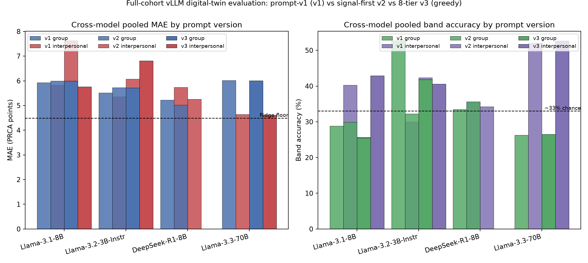

**Research question:** Across full-cohort vLLM runs on the **same prompt-v1** five-tier ladder (`demos` → `employment` → `geo` → `transit` → `full`), which open-weight instruct / distill models best recover ground-truth PRCA group and interpersonal scores — and do employment, transit, or cumulative context reduce absolute error (RQ1–RQ3)?

**Formal method pages:** [`docs/llm_baseline_llama31_v1.md`](../docs/llm_baseline_llama31_v1.md) · [`docs/llm_baseline_llama32_instruct_v1.md`](../docs/llm_baseline_llama32_instruct_v1.md) · [`docs/llm_baseline_deepseek_r1_distill_v1.md`](../docs/llm_baseline_deepseek_r1_distill_v1.md) · [`docs/llm_baseline_llama33_70b_v1.md`](../docs/llm_baseline_llama33_70b_v1.md) · [`docs/persona_prompt_versions.md`](../docs/persona_prompt_versions.md)

**Sibling memos (per model):** [`vllm_v1_llama31_8b.md`](vllm_v1_llama31_8b.md) · [`vllm_v1_llama32_3b.md`](vllm_v1_llama32_3b.md) · [`vllm_v1_deepseek_r1_distill.md`](vllm_v1_deepseek_r1_distill.md) · [`vllm_v1_llama33_70b.md`](vllm_v1_llama33_70b.md)

---

## Answer, Response, + Summary of Results

Using the Prolific↔Qualtrics matched analytic cohort (**n = 241**; inner join; complete scorable PRCA), we evaluated four GPU vLLM exports on **identical prompt-v1** Terrarium narratives (241 × 5 tiers = **1,205** prompts each):

| Model | Tag / export | Parse | Hardware / notes |
|---|---|---:|---|
| `meta-llama/Llama-3.1-8B-Instruct` | `20260726_0221` | 100% | fp8 Marlin WO · A5000 · 12.3 samp/s |
| `meta-llama/Llama-3.2-3B-Instruct` | `20260726_0252` | 100% | ~21.0 samp/s |
| `deepseek-ai/DeepSeek-R1-Distill-Llama-8B` | `20260726_0324` | **99.8%** (1202/1205) | fp8 Marlin WO · 1.34 samp/s · `</think>` strip |
| `meta-llama/Llama-3.3-70B-Instruct` | `llama_70b.csv` | 100% | **Mode collapse** — only **8** unique generations |

Metrics follow the project evaluator (`ca_personas.evaluate`): MAE / exact match / band accuracy on group & interpersonal PRCA (6–30; bands low≤13 / moderate 14–19 / high≥20). Classical ML floor for comparison: best transit **group MAE ≈ 4.49** (Ridge; [`docs/ml_baselines.md`](../docs/ml_baselines.md)).

**Short answer:** None of the models is a high-fidelity digital twin (exact match single-digit). Among **non-collapsed** runs, **DeepSeek-R1-Distill-Llama-8B** wins group CA (**5.22**), **Llama-3.2-3B-Instruct** wins interpersonal MAE (**5.35**) and group band accuracy (**52.7%**), and **Llama-3.1-8B-Instruct** uniquely recovers interpersonal bands above chance at demos/geo (~52%) but **collapses when transit is added** (IP MAE 4.67 → **8.17**). **Llama-3.3-70B** is a separate failure mode: ≈93% constant prior `(18, 12)` — do not rank it as a competitive twin despite a low IP MAE (**4.65**) that is an artifact of that prior. Employment (RQ1) is negligible for all; transit/full (RQ2–RQ3) help or hurt depending on model × subscale.

### Head-to-head (all tiers pooled)

| Model | MAE group ↓ | MAE IP ↓ | Exact G | Exact IP | Band G | Band IP | Notes |
|---|---:|---:|---:|---:|---:|---:|---|
| Llama-3.1-8B-Instruct | 5.92 | 5.82 | 6.1% | 9.0% | 28.8% | **40.2%** | Transit IP disaster |
| Llama-3.2-3B-Instruct | 5.51 | **5.35** | **9.1%** | 7.7% | **52.7%** | 30.0% | Best group bands |
| DeepSeek-R1-Distill-Llama-8B | **5.22** | 5.73 | 6.2% | 5.9% | 33.4% | 35.4% | Best group MAE; tier-stable |
| Llama-3.3-70B-Instruct | 6.02 | 4.65† | 6.4% | 12.4% | 26.3% | 52.0%† | †Constant prior; not person-tracking |

Non-collapsed models remain **above** the tabular Ridge floor (group MAE 4.49). Band accuracy vs ~33% chance: Llama-3.2 dominates **group** bands; Llama-3.1 leads **interpersonal** bands among models that still vary outputs (driven by demos/employment/geo, not transit).

### RQ1–RQ3 pattern by model

| RQ | Llama-3.1-8B | Llama-3.2-3B | DeepSeek-R1-Distill-8B | Llama-3.3-70B |
|---|---|---|---|---|
| **RQ1 employment** | Negligible | Negligible | Negligible / slight IP help | Null (collapsed) |
| **RQ2 transit** | Group slight help; **IP disaster** | Small group help; IP worse | Flat; no IP collapse | Null (flat collapse) |
| **RQ3 full** | Group band up; IP worse than demos | Best group MAE (5.29); IP mixed | Best IP MAE at full (**5.42**) | Negligible dips only |

**Interpretation.** Prompt-v1 transit text is a **model-dependent hazard**, not a universal aid. Llama-3.1 over-predicts interpersonal CA once mobility cues appear. Llama-3.2 and DeepSeek are more robust; DeepSeek is the most **tier-stable**, while Llama-3.2 is the best **coarse group-band** classifier among the three. Llama-3.3-70B shows that **scale alone does not fix** digital-twin recovery — without predictive variance, tier RQs are uninterpretable.

**Conclusion.** For prompt-v1 digital-twin evaluation on this cohort: prefer **DeepSeek-R1-Distill-Llama-8B** when minimizing group MAE, **Llama-3.2-3B-Instruct** when maximizing group band recovery / IP MAE, treat **Llama-3.1-8B-Instruct** as the cautionary transit-IP baseline that motivated packaging v2/v3, and treat **Llama-3.3-70B** as a **mode-collapse** cautionary case (not a scale win). No model yet closes the gap to classical ML (~4.5 MAE).

---

## v2 / v3 follow-up (evaluated)

The archived v2/v3 exports (`exports/v2/`, `exports/v3/`) answer the questions left open above. Pooled metrics:

| Prompt version | Model | MAE group | MAE IP | Transit IP | Notes |
|---|---|---:|---:|---:|---|
| v2 (v2_enhanced) | DeepSeek-R1-Distill-8B | **5.02** | **5.26** | **5.09** | Best live result; no collapse |
| v2 | Llama-3.2-3B-Instruct | 5.73 | 6.07 | 5.77 | v1 IP win (5.35) not replicated |
| v2 | Llama-3.1-8B-Instruct | 5.99 | 7.63 | 8.23 | Collapse persists; demos IP 8.45 |
| v3 (greedy, 8 tiers) | Llama-3.1-8B-Instruct | 5.99 | 5.76 | 7.77 | Single-cue ablations 4.85–5.92 |
| v3 | Llama-3.2-3B-Instruct | 5.72 | 6.81 | 6.14 | — |
| v3 | Llama-3.3-70B-Instruct | 6.01 | 4.61† | 4.61† | †Constant prior persists |

**Answers to the open questions:**

1. **Do v2/v3 remove Llama-3.1's transit IP collapse without harming DeepSeek / 3B?** *No for Llama-3.1.* Signal-first packaging + mobility anti-bleed do not stop the collapse (transit IP 8.23 ≈ 8.17) and raise its base IP error (demos 4.67 → 8.45). DeepSeek *improves* under v2 (group 5.22 → 5.02; IP 5.73 → 5.26). Llama-3.2-3B's v1 interpersonal advantage does not survive v2/v3 packaging.
2. **Is the collapse a packaging artifact or combination-specific?** *Combination-specific.* Greedy v3 single-cue tiers leave IP stable (`v3_public_transit` 4.85, `v3_voice` 5.82, `v3_rideshare` 5.92); only the bundled mobility dump collapses it (7.77).
3. **Can temperature / constrained decoding restore 70B variance?** *Not under greedy v3* (constant prior `(18, 12)` persists); the `v3_enhanced` / `large_model` presets remain untested on 70B.
4. **Signed-error / stereotyping slices across models?** Still open — run `ca-personas stereotype-eval` on each package's `tables/02_evaluation_rowlevel.csv`.

Open-text voice is **not** the collapse driver: `v3_voice` group MAE 5.64 / IP 5.82 for Llama-3.1 beat the kitchen-sink `transit` (6.07 / 7.77). On group MAE, `v3_rideshare` (5.86) is Llama-3.1's best tier, matching tabular Q28 dominance.

*Sources:* `data/vllm/llama3_1.md` · `data/vllm/llama32_instruct.md` · `data/vllm/deepseek-distilled/deepseek_v1.md` · `data/vllm/llama-3-70b/llama_70b.md` · docs LLM baselines · [github.com/Exios66/psych755-jjb](https://github.com/Exios66/psych755-jjb)

---

## What questions or uncertainties remain?

Do v2 (signal-first) and v3 (rideshare / public-transit / voice ablations) remove Llama-3.1’s transit IP collapse without harming DeepSeek / 3B gains? Can temperature / constrained decoding restore 70B variance? Are signed-error / stereotyping slices (Sex, Age, Student, Employment) aligned across non-collapsed models?

## What other analyses pair with this memo?

Per-model memos below unpack RQ tables and confusion matrices. Classical ceilings: [`docs/ml_baselines.md`](../docs/ml_baselines.md). Feature attributions (mock LLM era): [`feature_predictive_power_ml_llm.md`](feature_predictive_power_ml_llm.md). Prompt redesign rationale: [`docs/persona_prompt_efficiency.md`](../docs/persona_prompt_efficiency.md).
