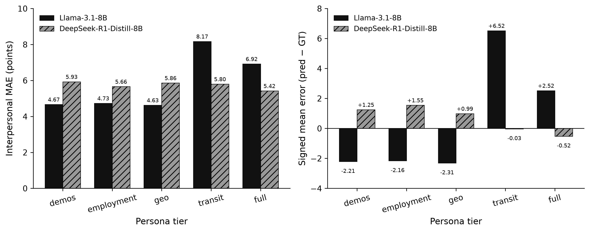

**Research question:** Does `meta-llama/Llama-3.1-8B-Instruct`, when personified via prompt-v1 cumulative Terrarium narratives, recover participants’ group and interpersonal PRCA scores — and do employment (RQ1), transit (RQ2), or full cumulative context (RQ3) reduce absolute error?

**Formal write-up:** [`docs/llm_baseline_llama31_v1.md`](../docs/llm_baseline_llama31_v1.md)  
**Cross-model memo:** [`vllm_v1_cross_model_comparison.qmd`](vllm_v1_cross_model_comparison.qmd)

---

## Answer, Response, + Summary of Results

Full-cohort vLLM run on the matched Prolific↔Qualtrics sample (**n = 241**; **1,205** prompts = 241 × 5 tiers; parse **100%**). Host `rogers-gpu-1.discovery.wisc.edu`; fp8 Marlin weight-only on NVIDIA RTX A5000; export stamp `20260726_0221`; throughput ≈ 12.3 samples/s.

**Short answer:** Engineering success (valid CA JSON) but **not** a digital twin. Pooled MAE is **5.92** (group) / **5.82** (IP). Interpersonal **bands** succeed at demos/employment/geo (~52%), then **collapse** at transit (IP MAE 4.67 → **8.17**; band 51.9% → **15.4%**) via systematic over-prediction (signed IP error ≈ +6.5). Employment does not help. Best group MAE (**5.68** at transit) still trails Ridge ML (**≈4.49**).

### Overall vs chance / ML floor

| Metric | Observed | Reference |
|---|---:|---|
| Exact group / IP | 6.1% / 9.0% | ~4% exact chance |
| Band group / IP | 28.8% / **40.2%** | ~33% band chance |
| MAE group / IP | 5.92 / 5.82 | ML floor group ≈ 4.49 |

: Llama-3.1-8B tier-level performance. {#tbl-v1l31-1}

### Metrics by tier

| Tier | MAE G | MAE IP | Band G | Band IP | Mean err IP |
|---|---:|---:|---:|---:|---:|
| demos | 6.05 | **4.67** | 25.7% | **51.9%** | −2.21 |
| employment | 6.03 | 4.73 | 25.3% | 51.9% | −2.16 |
| geo | 6.02 | 4.63 | 25.3% | **53.1%** | −2.31 |
| transit | **5.68** | **8.17** | 29.9% | **15.4%** | **+6.52** |
| full | 5.84 | 6.92 | **37.8%** | 29.0% | +2.52 |

: Tier / MAE G / MAE IP. {#tbl-v1l31-2}

### RQ verdicts

- **RQ1 (employment):** No — Δ MAE group −0.02; IP +0.07; bands flat.
- **RQ2 (transit):** Mixed / mostly no — small group MAE gain (−0.37) offset by catastrophic IP degradation (+3.51 MAE; −36.5 pp band).
- **RQ3 (full):** Mixed — group band rises to 37.8%; IP remains worse than demos-only.

**Conclusion.** Llama-3.1-8B-Instruct on prompt v1 behaves like a **prior / stereotype engine** that recovers coarse interpersonal bands from demographics alone, then **over-weights mobility cues toward high interpersonal CA**. Signed IP error flips from **−2.21** (demos) to **+6.52** (transit); DeepSeek on the same ladder stays flat. This failure mode motivated prompt packaging v2/v3 (signal-first transit text; subscale independence). v2 has been GPU-evaluated on Llama-3.1 (v2_enhanced; Rogers GPU; July 28) and **Llama-3.2-3B** (v2_enhanced; July 28). The v2_enhanced decode **did not resolve** the transit IP collapse on Llama-3.1 (transit IP MAE = 8.23 vs v1's 8.17). v3 prior-greedy runs are archived on Llama-3.1, Llama-3.2-3B, and Llama-3.3-70B (July 29; 8 tiers). The pooled v2/v3 multi-model evaluation is committed ([`vllm_v2_v3_evaluation.qmd`](vllm_v2_v3_evaluation.qmd)); only the canonical `v3_enhanced` decode refresh remains pending. Treat this memo as the canonical **v1 cautionary baseline**, not as evidence that larger Llama models are better digital twins on this task.

{#fig-v1l31-vllm-v1-llama31-ip-collapse}

*Sources:* `data/vllm/llama3_1.md` · `docs/llm_baseline_llama31_v1.md` · evaluator `ca_personas.evaluate` · [github.com/Exios66/psych755-jjb](https://github.com/Exios66/psych755-jjb)

---

## What questions or uncertainties remain?

Does the transit IP collapse replicate under v2 packaging without changing model weights? Which demographic slices widen MAE gaps at transit (Sex / Age / Student / Employment stereotyping CSVs in the export package)? Would constrained decoding or lower temperature reduce over-prediction? Participant-level prediction histograms await staging of the gitignored raw export.

## What other analyses pair with this memo?

Cross-model ranking: [`vllm_v1_cross_model_comparison.qmd`](vllm_v1_cross_model_comparison.qmd). Smaller Llama and DeepSeek distill siblings: [`vllm_v1_llama32_3b.qmd`](vllm_v1_llama32_3b.qmd), [`vllm_v1_deepseek_r1_distill.qmd`](vllm_v1_deepseek_r1_distill.qmd). Prompt redesign: [`docs/persona_prompt_efficiency.md`](../docs/persona_prompt_efficiency.md). Manuscript figure: `memos/figures/vllm_v1_llama31_ip_collapse.png`.
